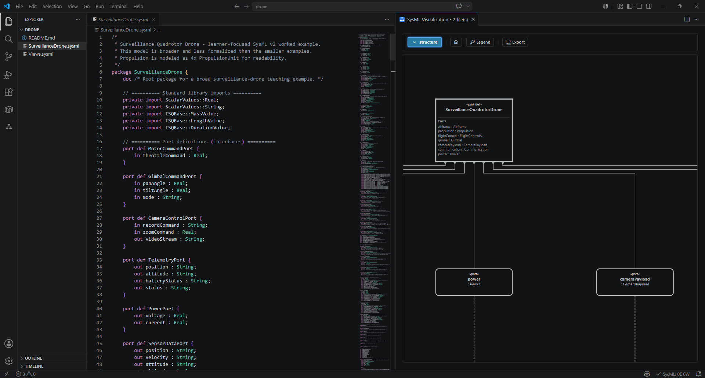

# Spec42

Spec42 is modern language tooling for [SysML v2](https://www.omg.org/sysml/sysmlv2/) and KerML. It gives systems engineers and tool builders a practical way to edit, inspect, validate, and automate textual models with the same analysis engine in the editor, CLI, CI, and assistant workflows.


[](LICENSE)
[](https://marketplace.visualstudio.com/items?itemName=Elan8.spec42)
[](https://github.com/elan8/spec42/releases)



## What Spec42 Provides

- **Editor feedback for SysML v2 and KerML**: diagnostics, semantic highlighting, completion, hover, definitions, references, document symbols, and hierarchy navigation.
- **Model exploration**: a Model Explorer for workspace structure and a Model Visualizer for graphical views of the same semantic model.
- **Repeatable validation**: `spec42 check` for local use, scripted quality gates, SARIF output, and GitHub Code Scanning.
- **Standard-library support**: bundled SysML library resolution plus `spec42 doctor` for environment and configuration diagnostics.
- **Headless diagrams**: deterministic JSON and SVG export for supported views, suitable for CI artifacts and documentation pipelines.
- **Automation and assistant integration**: a GitHub Action, CLI assistant commands, and an MCP server exposing validation and model-summary tools.
- **Reusable example content**: compact examples and domain libraries for software, communication, electronics, robotics, and systems-engineering workflows.

Spec42 is designed around one expectation: the model should mean the same thing whether you inspect it in VS Code, validate it in CI, or hand it to another tool.

## Quick Start

### VS Code

1. Install [SysML v2 Editor (Elan8.spec42)](https://marketplace.visualstudio.com/items?itemName=Elan8.spec42).
2. Open a `.sysml` or `.kerml` file, for example [`examples/timer/KitchenTimer.sysml`](examples/timer/KitchenTimer.sysml).
3. Run **SysML: Show SysML Model Explorer** to browse the model.
4. Run **SysML: Open SysML Visualizer** to inspect supported graphical views.

Marketplace builds include the matching `spec42` language server binary.

### CLI

Download a release from [GitHub Releases](https://github.com/elan8/spec42/releases), extract the archive for your platform, and put `spec42` on your `PATH`.

```bash
spec42 doctor
spec42 check examples/timer/KitchenTimer.sysml
spec42 check examples/timer/KitchenTimer.sysml --format sarif
spec42 diagrams export examples/office --view general-view --format svg --output target/diagrams
```

Use `spec42 doctor` first when library paths, editor setup, or CI behavior differ from what you expect.

### GitHub Action

```yaml
permissions:
  contents: read
  security-events: write

jobs:
  spec42:
    runs-on: ubuntu-latest
    steps:
      - uses: actions/checkout@v6
      - uses: elan8/spec42@v0.29.0
        with:
          path: examples/timer/KitchenTimer.sysml
          format: sarif
          warnings-as-errors: true
```

See [docs/user/GITHUB-ACTION.md](docs/user/GITHUB-ACTION.md) for inputs, SARIF upload behavior, and advanced usage.

### AI Assistants

Spec42 includes `spec42-mcp`, a stdio MCP server for assistant workflows, plus CLI commands such as `spec42 model-summary` and `spec42 explain-diagnostic`.

See [docs/user/AI-ASSISTANTS.md](docs/user/AI-ASSISTANTS.md) for Copilot, Cursor, and MCP setup notes.

## Supported Views

Spec42 currently focuses on the views that are most useful for day-to-day model understanding:

| View | Purpose |
| --- | --- |
| General View | High-level structure and relationships across a model. |
| Interconnection View | Parts, ports, connectors, and system architecture wiring. |
| Action Flow View | Control and data flow through actions in a behavior. |
| State Transition View | States and transitions for lifecycle-oriented behavior. |

Diagram export supports JSON payloads and SVG for the supported headless renderers. Routed SysML views use vendored ELK.js through embedded QuickJS for deterministic CI behavior.

## Examples and Libraries

Start with the examples if you are evaluating Spec42 or learning SysML v2:

| Example | Best For |
| --- | --- |
| [`examples/office`](examples/office/README.md) | Smallest first read: parts, ports, connections, and simple behavior. |
| [`examples/timer`](examples/timer/README.md) | Recommended first substantial model and flagship validation example. |
| [`examples/intersection`](examples/intersection/README.md) | Controller and state-machine behavior in a familiar system. |
| [`examples/webshop`](examples/webshop/README.md) | Software architecture, interactions, requirements, and views. |
| [`examples/drone`](examples/drone/README.md) | Broader system decomposition with mission behavior and requirements. |

The [`domain-libraries`](domain-libraries/README.md) directory contains reusable SysML v2 library content for technical and domain-specific modeling.

## Installation

Install the VS Code extension from the Marketplace:

- [SysML v2 Editor (Elan8.spec42)](https://marketplace.visualstudio.com/items?itemName=Elan8.spec42)

Download release artifacts from [GitHub Releases](https://github.com/elan8/spec42/releases):

- Platform archives contain `spec42` and `spec42-mcp`.
- The `.vsix` package contains the VS Code extension and bundled server.
- The Zed bundle contains the extension source; the extension can download the matching server binary when needed.

After installing a binary, verify the environment with:

```bash
spec42 doctor
```

## Repository Layout

| Path | Contents |
| --- | --- |
| [`crates/kernel`](crates/kernel) | LSP runtime, workspace indexing, validation, and editor-facing services. |
| [`crates/semantic_core`](crates/semantic_core) | Semantic graph construction, resolution, diagnostics, and model projection. |
| [`crates/server`](crates/server) | CLI, HTTP API, MCP server, reports, and diagram export. |
| [`vscode`](vscode/README.md) | VS Code extension, webviews, packaging, and tests. |
| [`zed`](zed/README.md) | Zed extension. |
| [`shared/diagram-renderer`](shared/diagram-renderer/README.md) | Shared TypeScript diagram renderer used by editor and export workflows. |
| [`docs`](docs/README.md) | User, architecture, engineering, API, and reference documentation. |
| [`examples`](examples/README.md) | Example SysML workspaces. |
| [`domain-libraries`](domain-libraries/README.md) | Reusable SysML libraries and domain examples. |

## Building

```bash
cargo build --release
cd vscode && npm install && npm run compile
```

```bash
cd zed
cargo build --target wasm32-wasip2 --release
```

For contributor setup, test commands, packaging notes, and release checks, see [DEVELOPMENT.md](DEVELOPMENT.md).

## Documentation

- [User documentation](docs/README.md)
- [VS Code extension guide](vscode/README.md)
- [GitHub Action guide](docs/user/GITHUB-ACTION.md)
- [Troubleshooting](docs/user/TROUBLESHOOTING.md)
- [API documentation](docs/api/README.md)
- [Conformance matrix](docs/reference/CONFORMANCE-MATRIX.md)

## License

MIT. See [LICENSE](LICENSE). The embedded SysML standard library is subject to separate licensing; see [THIRD_PARTY_NOTICES.md](THIRD_PARTY_NOTICES.md).
