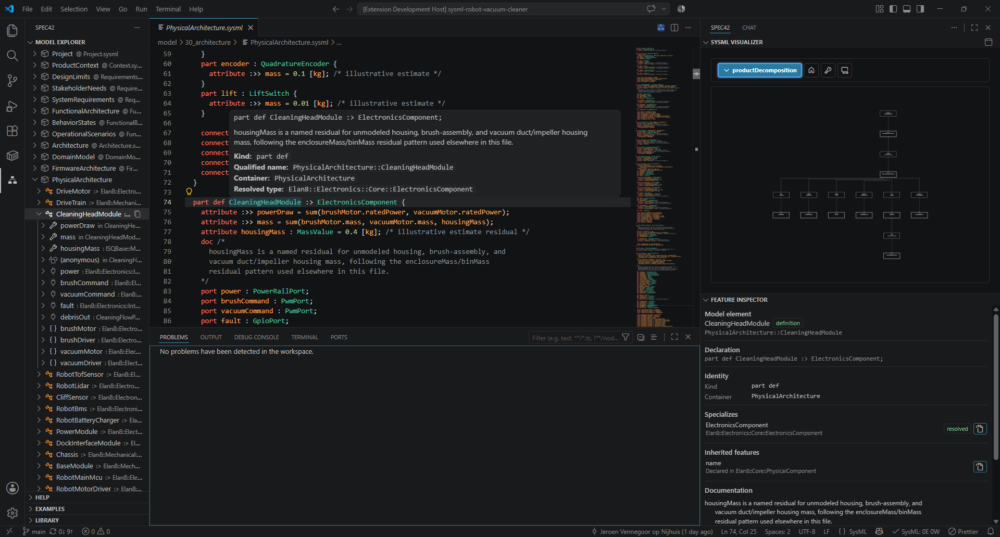

# Spec42

Spec42 is open, local-first tooling for [SysML v2](https://www.omg.org/sysml/sysmlv2/) and KerML: edit textual models with live feedback, understand structure and behavior beyond the source, and keep the same analysis engine in the editor, CI, and assistant workflows.


[](LICENSE)
[](https://marketplace.visualstudio.com/items?itemName=Elan8.spec42)
[](https://github.com/elan8/spec42/releases)



## Why Spec42

SysML v2 is powerful, but textual models only help when the tooling keeps pace: clear feedback while editing, a trustworthy picture of structure and behavior, and validation that does not change meaning when it leaves the IDE.

Spec42 is built for that continuity. One immutable analysis publication backs the VS Code extension, CLI validation, GitHub Actions, generators, and assistant integrations. What you see while modeling is what CI will check.

It stays local-first: the language server, standard library, and Elan8 domain/method libraries ship with Spec42. You can work offline, keep models in your own repositories, and adopt automation without a proprietary runtime.

## What you get

- **A capable SysML v2 / KerML editor** — diagnostics, semantic highlighting, completion, hover, navigation, rename, symbols, and formatting for day-to-day modeling.
- **Ways to understand the model, not just the text** — navigation and Feature Inspector consume typed semantic queries for resolved typing, inheritance, relationships, and values.
- **Validation you can trust in automation** — the same engine in `spec42 check`, with text/JSON/SARIF/JUnit output for local scripts and CI quality gates.
- **Extensible model products** — generators consume the immutable publication; the VS Code diagram experience is backed by a repository-owned generator plugin and a versioned render product rather than a built-in semantic subsystem.
- **Libraries ready to use** — bundled OMG SysML libraries plus searchable Elan8 domain and method libraries, with room for your own library roots.
- **Room for assistants** — Copilot Language Model Tools in VS Code, plus CLI helpers for other AI hosts.

## Where Spec42 fits

| Surface | Role |
| --- | --- |
| **VS Code** | Primary modeling environment: edit, navigate, diagram, inspect. |
| **CLI** | Doctor, check, validation-only model summary, generation, and assistant-oriented commands. |
| **GitHub Action** | Repeatable model validation with optional SARIF upload. |
| **LM Tools** | Validation and model context for AI-assisted workflows. |
| **Zed** | Lightweight editor support with the same server family. |

## Views

| View | What it is for |
| --- | --- |
| General View | Structure and relationships across the exposed model. |
| Interconnection View | Parts, ports, connectors, and architecture wiring. |
| Action Flow View | Control and data flow through actions. |
| State Transition View | States and transitions for lifecycle behavior. |
| Sequence View | Lifelines and messages for interaction-oriented models. |
| Browser View | Hierarchical membership browsing. |
| Grid View | Tabular arrangement of exposed elements and relationships. |
| Geometry View | Spatial items (partial while authored geometry and 3D catch up). |

## Examples

| Example | Best for |
| --- | --- |
| [`examples/office`](examples/office/README.md) | Smallest first read: parts, ports, connections, simple behavior. |
| [`examples/timer`](examples/timer/README.md) | Recommended first substantial model. |
| [`examples/intersection`](examples/intersection/README.md) | Controllers and state machines. |
| [`examples/webshop`](examples/webshop/README.md) | Software architecture, requirements, and views. |
| [`examples/drone`](examples/drone/README.md) | Broader system decomposition and mission behavior. |

## Get started

1. Install **[SysML v2 Editor](https://marketplace.visualstudio.com/items?itemName=Elan8.spec42)** from the VS Code Marketplace.
2. Open a `.sysml` / `.kerml` file, or try the bundled **timer** example from the Spec42 sidebar.
3. Follow the full walkthrough in **[Getting Started](docs/user/GETTING-STARTED.md)**.

To start a clean multi-file workspace from the CLI, run:

```bash
spec42 init my-model
```

The target must be new or empty; `init` never overwrites existing files and validates the generated workspace before reporting success.

CLI and CI users can download platform archives from [GitHub Releases](https://github.com/elan8/spec42/releases). Setup details for Actions, assistants, and troubleshooting live in the docs linked below.

## Documentation

- [User documentation](docs/README.md) — getting started, diagram view, Feature Inspector, libraries
- [VS Code extension](vscode/README.md)
- [GitHub Action](docs/user/GITHUB-ACTION.md)
- [AI assistants](docs/user/AI-ASSISTANTS.md)
- [Troubleshooting](docs/user/TROUBLESHOOTING.md)
- [What's included](docs/reference/WHATS-INCLUDED.md)
- [Conformance matrix](docs/reference/CONFORMANCE-MATRIX.md)
- [Contributor development guide](DEVELOPMENT.md)

## License

MIT. See [LICENSE](LICENSE). The embedded SysML standard library is subject to separate licensing; see [THIRD_PARTY_NOTICES.md](THIRD_PARTY_NOTICES.md).
