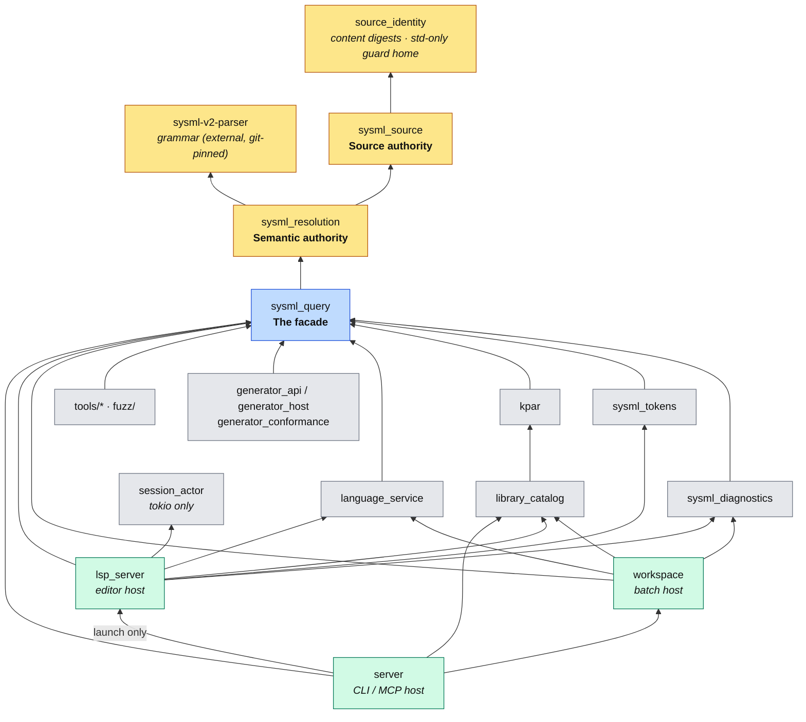

# Spec42 design

This document states the enduring architecture of Spec42: which crate is the authority for what,
how consumers reach the model, and which invariants the repository enforces. It changes only when a
new product requirement changes the architecture. It does not record migration history, open work,
test procedures, or performance figures.

Where things live:

| Concern | Document |
|---|---|
| Repository policy for new and modified code | [`AGENTS.md`](AGENTS.md) |
| Build, test, release, and parser-bump procedures | [`DEVELOPMENT.md`](DEVELOPMENT.md) |
| Contracts of individual query products | [`docs/architecture/`](docs/architecture/) |
| Active decisions, blockers, and remaining work | [`planning/`](planning/) |

## One semantic system

Every semantic fact category has one authoritative owner and representation for a model state, and
every surface uses the same semantic results for identical inputs. `AGENTS.md` states that policy;
this document states the structure that makes it true.

## The authority pipeline

An **authority** is the only crate that may perform a given operation. Spec42 has two, arranged in
one chain, behind one facade:

| Authority | Crate | The only place that may… |
|---|---|---|
| Source | `sysml_source` | read a SysML file from disk, admit text as a document, normalise a URI or line endings, compute a content digest |
| Semantic | `sysml_resolution` | call the parser, hold a parsed tree, lower an AST, resolve names, evaluate, decide a diagnostic, compute a library closure, build or publish a model, own a publication's lifecycle |

`sysml_query` is the **facade**: the only crate a consumer may name for anything SysML. It exposes
the authorities as typed services and contains no semantic logic of its own.

`sysml_contract` is the **vocabulary**: the value types every SysML answer is spoken in — element
kinds, visibilities, relationship families, outcome and prerequisite enums, positions and ranges,
diagnostic codes, opaque identity newtypes, the sealed view traits, and the semantic contract
version. It computes nothing, holds no state, and names no authority. The authority *implements*
the contract; the facade *re-exports* it verbatim; consumers reach it only through the facade.
*Why:* a contract the authority defines is not a contract — every internal rename is an API break
and every field is a pinned representation. A contract the authority implements lets the authority
change layout freely and makes a vocabulary change a deliberate, versioned act.

Each link in the chain has exactly one dependant:

```text
sysml-v2-parser ──────────────────────► sysml_resolution ──► sysml_query ──► consumers
source_identity ──► sysml_contract ──► sysml_source ──────┘
```

Invariants of the pipeline:

- **One parse.** A source revision is parsed once. The editor's syntax queries and the semantic
  build share the same parsed tree through a memoised handle; no consumer can cause a second parse
  of identical content.
- **Memoisation is invisible.** Caches, memos, and stratum reuse are implementation details behind
  service handles. A consumer cannot tell a warm hit from a cold computation, and cannot hold,
  serialise, or rebuild a cached value. A persistent (on-disk) tier may be introduced only with a
  benchmark showing it beats recomputation on the bundled standard-library corpus; at current
  corpus sizes parsing is cheaper than deserialising.
- **No file I/O below or beside the source authority.** `sysml_resolution` never reads a file; hosts
  never read SysML text.
- **Analysis is a service, not a consumer algorithm.** If an answer is derived from SysML syntax or
  semantics — declared packages, import closure, token roles, anything — the derivation lives in the
  semantic authority and is reached through a typed query. A consumer that needs a new answer
  extends the service; it does not compute the answer from facade data, source text, or names.
  *Why:* two derivations of one fact drift; the repository has already shipped divergent severity
  labels and file-admission predicates from exactly this pattern.
- **Facade types expose identities, enums, and borrowed views — never owned storage.** A public
  contract type may carry `Copy` values, exhaustive enums, opaque ids, and `&'m` accessors or
  `impl Iterator` over a publication; it may not carry `String`, `Box<str>`, `Vec`, `Box<[T]>`, or
  map fields. An element handle is an identity, not a string; materialising its text is a boundary
  operation a consumer asks for explicitly. *Why:* an owned field is an allocation per result on
  every keystroke and a pinned representation the authority can never change; a borrowed view costs
  nothing and lets dense layouts, arenas, and interning change underneath without touching a host.
- **A sealed publication holds no parse tree.** Every location, range, and name a query can return is
  settled into the model at the publication barrier; the parse tree is owned by the syntax service
  only. *Why:* retaining trees multiplies resident memory by the corpus and turns every navigation
  query into a source-text scan.
- **Representation changes are admitted with a benchmark.** A change to storage layout, indexing, or
  reuse lands only with the bench set (`cargo bench` on the bundled standard-library corpus: cold
  build, warm relink, and the keystroke-path queries) showing neutral-or-better. *Why:* the memoisation
  invariant says consumers cannot tell; the bench is how maintainers can.

## Services

Consumers reach the model through five services on the facade. All handles are cheap to clone and
share one set of authorities per host process.

| Service (`sysml_query::…`) | Handle | Owns |
|---|---|---|
| `source::SourceService` | `SourceDocument` | admission of text as an identified document; URI normalisation; line-ending policy; providers (filesystem with ignore rules, in-memory, library roots); content digests |
| `syntax::SyntaxService` | `ParsedSource` | the parser call and parse memo; syntax-fidelity queries over a parsed tree: outline, folding, token roles, package declarations, closure facts, reserved keywords; formatting-preservation checks |
| `library::LibraryClosureService` | `LibraryClosure` | the package index over library roots and the transitive import closure a workspace needs, with its seed signature |
| `publication::PublicationService` and `PublicationSession` | `PublishedModel`, `RelinkToken`, `BuildToken`, `SessionLifecycle` | partitioning admitted documents by provenance, library-stratum reuse, constructing the immutable publication; the publication lifecycle (startup, relink, reindex, reset), its tokens, and the barrier that admits a finished build |
| `PublishedModel` queries | `navigation()`, `types()`, `diagnostics()`, … | typed, opaque semantic queries over one immutable publication |

A host obtains every handle from one `Services` value (`Services::new()`); sources come from the
filesystem provider or `SourceService::admit_memory` for WebAssembly, fuzzing, conformance, and
benchmarks. There is exactly one `Services` per host process.

New capability lands in this order: implementation in the owning authority, a typed contract in
`sysml_query`, then use from a host. Never the reverse.

## Phases inside the semantic authority

The authority is one crate but not one module. Construction is a sequence of phases, each a
module under `sysml_resolution/src/` with one writer that consumes the previous phase's product
and yields the next as a distinct type:

```text
pipeline ─► lower ─► resolve ─► evaluate ─► index ─► check ─► diagnose ─► publication
            Lowered   Resolved   Evaluated   Indexed  ───────────────────► Complete
```

- A phase reads only earlier products and writes only its own store; the previous product is
  moved, not borrowed mutably, so there is no write-back and no half-built model to observe.
- Every derived fact has one writer. Evaluation is decided in `evaluate`, never at lowering time;
  diagnostics are decided in `diagnose`, never mid-construction.
- `model/query` reads `Complete` only. Projections (diagram scenes, navigation) read settled indexes;
  they do not derive at projection time.
- No `use super::*` outside `#[cfg(test)]`; a phase names what it depends on.
- Tests that build a full model and assert on its canonical projection are contract tests and live
  in `tests/`; only tests of interning, arena growth, solver bounds, and memo lifecycle stay inline.

*Why:* the crate is half the repository. Without phase boundaries the sole authority becomes the
sole file nobody can safely change — the same failure the authority pipeline exists to prevent,
one level down.

## Crate map



Yellow is the authority chain; blue is the facade; grey crates are library consumers; green crates
are hosts. No grey or green edge reaches yellow.

| Crate | Role | May depend on (SysML crates) |
|---|---|---|
| `source_identity` | typed content digests and manifests; home of the std-only authority guards | — |
| `sysml_contract` | the semantic vocabulary and its version; value types, opaque ids, sealed views; computes nothing | `source_identity` |
| `sysml_source` | source authority | `source_identity`, `sysml_contract` |
| `sysml_resolution` | semantic authority; implements `sysml_contract` | `sysml-v2-parser`, `sysml_source`, `sysml_contract` |
| `sysml_query` | facade | `sysml_resolution` |
| `sysml_diagnostics` | transport-neutral diagnostic values and reporting policy; decides nothing semantic | `sysml_query` |
| `sysml_tokens` | projection of facade token roles onto editor token indices; host-neutral | `sysml_query` |
| `kpar` | KerML Project Archive read, pack, and validate | `sysml_query` |
| `language_service` | protocol-neutral editor intelligence over typed queries | `sysml_query` |
| `library_catalog` | library provisioning: bundled and managed standard/domain libraries, configuration, data directories; yields library roots | `kpar` |
| `session_actor` | generic asynchronous mailbox over embedder state; knows nothing about SysML | — |
| `workspace` | batch host: engine, directory snapshot, validation path and reports, comparison, schema versions | `sysml_query`, `library_catalog`, `language_service`, `sysml_diagnostics` |
| `lsp_server` | editor host: session, LSP handlers, host adapters; owns no validation pipeline and no batch entry point | consumers above, not `workspace` |
| `server` | CLI, MCP, and LSP binary; validation through `workspace`, `lsp_server` is a launch edge only | consumers above |
| `generator_api`, `generator_host`, `generator_conformance` | sandboxed generators over typed model queries | `sysml_query` |

## Hosts

A host adapts explicit service inputs and outputs to a transport, an editor, a process, or a
filesystem policy. Hosts may own: where files come from and which are ignored, protocol mapping,
presentation (labels, symbol kinds, snippets, hover prose), scheduling, and configuration. Hosts may
not own: parsing, parsed trees, caches of derived values, library closure, semantic decisions, or
publication lifecycle state outside a `PublicationSession`.

| Host | Shape |
|---|---|
| Batch (`workspace`) | load a directory through the source service, publish once through the publication service, query, compare; no session |
| Editor (`lsp_server`) | keeps `ServerState` inside a `session_actor` mailbox; `ServerState` holds the `PublicationSession` and, per document, a `SourceDocument` and its `ParsedSource`; every parse goes through the syntax service |
| CLI / MCP (`server`) | thin adapters over the batch host: validation, reports, generation; reaches `lsp_server` only to launch the editor host (`run_lsp`, config, tracing, custom RPC); one `Services` shared by both |
| Generators | receive an immutable `PublishedModel` and typed queries; never source text |

## Publication lifecycle and identity

A publication is an immutable `PublishedModel` with a dependency-complete, owner-scoped identity
derived from the content digests of every admitted document, their provenance, and the semantic
contract version. Cold, warm, sequential, and parallel construction of the same inputs produce the
same identity and observably equivalent results.

`PublicationSession` owns the lifecycle for a long-lived host. It separates two token kinds:

- a **relink token** gates editor-staged symbol commits; every edit supersedes the previous one;
- a **build token** carries the identity a build was started for; a finished build is admitted only
  if its owner is still current *and* its identity still matches the session's inputs. Admission is
  independent of relink generation, so an edit arriving while a build runs does not discard a build
  whose inputs it did not change.

The session also carries a monotonically increasing **version** that hosts report to clients and
use to gate diagnostics. Failed, cancelled, stale, identity-mismatched, and out-of-order builds leave
the last coherent publication in place and report a typed outcome.

Library documents are resolved once into a library stratum keyed by their digests and reused across
publications whose library inputs are unchanged.

## Versioning and compatibility

| Surface | Versioned by | Stable across |
|---|---|---|
| semantic vocabulary | `sysml_contract::SEMANTIC_CONTRACT_VERSION`, hashed into every publication identity | a release; bumped when a contract type or derivation meaning changes |
| diagnostic codes | `DiagnosticCode` in `sysml_contract`; codes are never reused | all releases |
| KPAR archive | `kpar` schema version | documented in `docs/reference` |
| generator protocol | `generator_protocol` version | documented in `docs/generation` |

Cold, warm, sequential, and parallel builds of the same inputs yield the same identity; this is a
user-facing guarantee (reproducible validation in CI) and is tested as one.

## Amending this document

A change here is a change to the architecture. It lands as the first commit of the PR that
implements it, with: the invariant, its *why*, the enforcement row that makes it irreversible, and
the benchmark where representation is involved. A guard is never loosened to admit a change; the
change is redesigned or the invariant is amended here first.

## Enforcement

Each invariant above is checked in a place the constrained crates cannot disable.

| Invariant | Where it is enforced |
|---|---|
| the parser is a dependency of `sysml_resolution` only; `sysml_resolution` of `sysml_query` only; `sysml_source` of `sysml_resolution` only | `deny.toml` (`cargo deny check bans`, resolved graph, dev-dependencies included); `crates/source_identity/tests/parser_authority.rs` and `authority_chain.rs` (manifest shape, nested `fuzz/` workspace, both lockfiles, local facade renames) |
| exact dependency sets of the chain crates, the facade, `session_actor`, `workspace`, `lsp_server` (no `workspace`) and `server`; every downstream crate is a designated consumer; no async runtime in the chain | `crates/sysml_query/tests/architecture.rs` (cargo metadata) |
| the facade publishes no parser or graph type and no text-taking syntax entry point | `crates/sysml_query/tests/architecture.rs` (public API visitor) |
| no consumer re-implements a facade query, revives a retired heuristic, holds a parsed tree or stratum outside the allow-listed host fields, or reads SysML files | `crates/sysml_query/tests/syntax_authority.rs` (retired-name list, shadowed-name set, source-probe detector with predicate-backed exemptions, field and I/O bans) |
| a host declares no SysML text entry point and no document-keyed map outside the session's index, both against a shrinking allow-list | `crates/sysml_query/tests/architecture.rs` (AST visitors over `lsp_server/src` and `server/src`) |
| one `Services` per host; library closure never on the edit path | `crates/lsp_server/tests/debt_guardrails.rs` |
| reporting policy decides nothing semantic | `crates/sysml_diagnostics/tests/dependency_guardrails.rs` |
