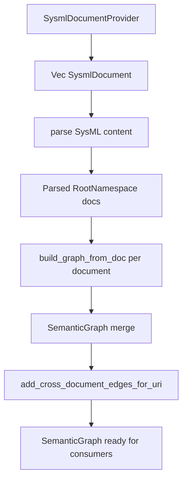
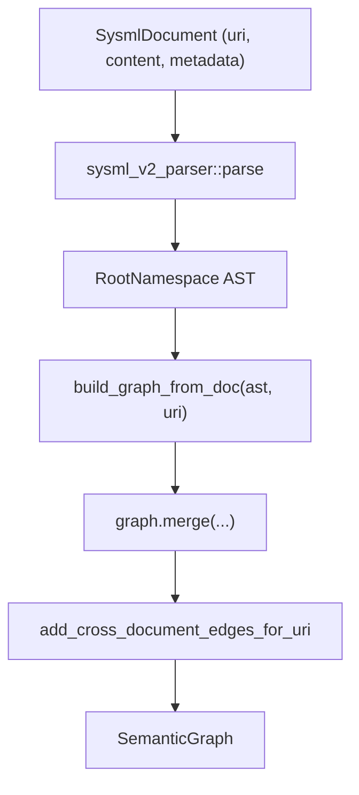
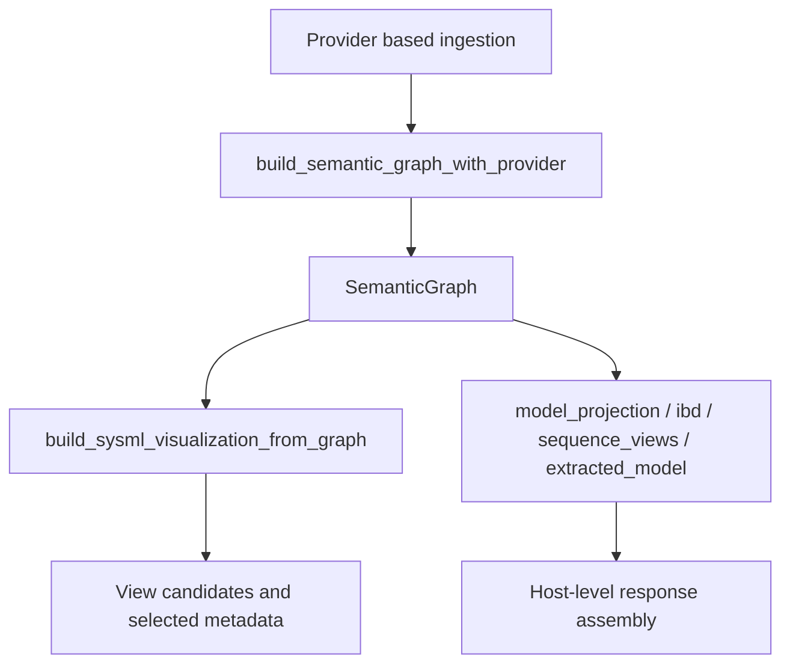

# semantic_core Architecture and Functionality

This document explains what `semantic_core` does, how its modules fit together, and how visualization is built from the semantic graph.

## Purpose

`semantic_core` is the reusable, non-LSP semantic engine for SysML v2:

- it ingests SysML documents from pluggable sources
- parses and links them into a `SemanticGraph`
- provides semantic resolution/evaluation helpers
- exposes visualization-oriented DTOs and graph-first visualization metadata APIs

The crate is designed to be consumed by multiple hosts (`kernel`, `babel42`, and future services), without hard-coding filesystem or editor runtime concerns into the semantic core.

## High-Level Capabilities

- Source-agnostic SysML ingestion through provider abstractions
- Graph construction from parsed AST (`build_graph_from_doc`)
- Cross-document relationship linking
- Semantic resolution (imports, references, names, typing/specialization)
- Expression evaluation and unit-aware calculations
- Shared DTOs for model/graph/visualization payloads
- Graph-first visualization entrypoint (`build_sysml_visualization_from_graph`)
- Graph-first diagnostics entrypoint (`collect_diagnostics_from_graph`)

## Module Overview

- `semantic/source/*`
  - `SysmlDocument`, `SysmlDocumentProvider`, `InMemoryDocumentProvider`
  - filesystem adapter provider (`FileSystemDocumentProvider`)
- `semantic/workspace_graph.rs`
  - provider/document-based graph assembly
  - `build_semantic_graph_from_documents`
  - `build_semantic_graph_with_provider`
- `semantic/graph_builder/*`
  - AST-to-graph construction
- `semantic/relationships.rs`
  - cross-document edges and relationship resolution
- `semantic/import_resolution.rs`, `semantic/reference_resolution.rs`, `semantic/resolution/*`
  - symbol and type/reference resolution
- `semantic/evaluation/*`
  - semantic expression evaluation + units
- `semantic/dto.rs`
  - shared DTO types for graph/model/visualization
- `semantic/model_projection.rs`, `semantic/ibd.rs`, `semantic/extracted_model.rs`, `semantic/sequence_views/*`
  - reusable visualization helper logic
- `semantic/visualization_entry.rs`
  - graph-first visualization API surface
- `semantic/diagnostics/*`
  - neutral diagnostics DTOs and graph-first diagnostics engine

## Source-Agnostic Ingestion Flow

### Providers

Current provider implementations:

- `FileSystemDocumentProvider` (filesystem traversal + file load)
- `InMemoryDocumentProvider` (already-loaded content, e.g. API/DB pipeline)

Future provider examples:

- DB-backed provider (Babel42 commit storage)
- remote/blob provider
- cached/streaming provider

## Semantic Graph Pipeline

### Output Artifacts

Graph assembly returns:

- `SemanticGraph`: linked semantic model across documents
- parsed document metadata (content, parse timings, cache flags) for callers that need richer context

## Visualization Architecture (Graph-First)

Visualization should consume semantic graph data, not directly depend on filesystem scanning.

### Key Principle

- `semantic_core` owns semantic and reusable projection logic.
- Hosts (`kernel`, `babel42`) decide transport/runtime concerns and final response wiring.

## Consumer Boundaries

### `kernel` (LSP/runtime host)

- uses filesystem provider for workspace scans
- uses semantic graph and helper projections for model/visualization endpoints
- maps semantic-core diagnostics into LSP diagnostics at the boundary
- keeps LSP protocol/runtime behavior outside semantic_core

### `babel42` (service/API host)

- can use in-memory (or future DB) providers
- avoids temporary workspace-only coupling for semantic graph creation
- consumes graph-first visualization metadata API from semantic_core
- maps semantic-core diagnostics into `babel42_core::DiagnosticDto` for storage/API responses

## Data Contracts

Shared DTOs in `semantic_core::semantic::dto` provide:

- graph primitives (`SysmlGraphDto`, `GraphNodeDto`, `GraphEdgeDto`)
- model structure (`SysmlElementDto`, `WorkspaceModelDto`)
- visualization metadata (`SysmlVisualizationViewCandidateDto`, `SysmlVisualizationResultDto`)
- stats (`SysmlModelStatsDto`)

This keeps host responses aligned around a common semantic contract.

## Extension Guidance

When adding new functionality:

1. Add new data source as a `SysmlDocumentProvider` (do not add direct filesystem logic into graph core).
2. Keep semantic/graph logic in `semantic_core`.
3. Keep transport/runtime concerns in host crates.
4. Prefer graph-first APIs for reusable features.
5. Add tests for provider parity and graph behavior consistency.

## Summary

`semantic_core` is now structured as a reusable semantic platform:

- source abstraction for ingestion
- graph-centric semantic processing
- reusable visualization helper logic
- reusable diagnostics engine with neutral contracts
- host-agnostic contracts for model/visualization/diagnostics outputs

This enables multiple ingestion backends (filesystem, DB, in-memory) while preserving one semantic pipeline.
