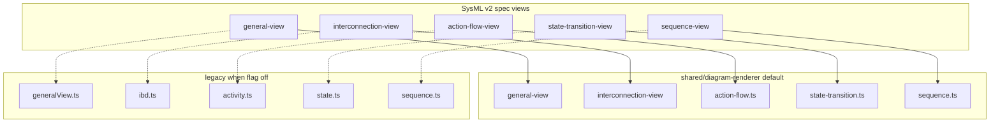

# Shared diagram renderer and SysML v2 graphical notation

This document describes how the **shared diagram renderer** (`shared/diagram-renderer`) relates to the **legacy Spec42 webview renderers**, what **SysML v2 Clause 8.2.3** expects, where we stand today, and a phased plan to reach full graphical-notation conformance for the views we ship.

**Related docs**

- [`shared/diagram-renderer/README.md`](../shared/diagram-renderer/README.md) — build, theme, structure CSS classes
- [`docs/SUPPORTED-WORKFLOWS.md`](SUPPORTED-WORKFLOWS.md) — release-gating vs experimental views
- [`docs/SHARED-RENDERER-PARITY.md`](SHARED-RENDERER-PARITY.md) — shared vs legacy parity checklist
- [`docs/GENERAL-VIEW-ELEMENT-AUDIT.md`](GENERAL-VIEW-ELEMENT-AUDIT.md) — general-view element → canvas audit (Phase 2.1)
- [`docs/SYSML-NOTATION-INVENTORY.md`](SYSML-NOTATION-INVENTORY.md) — BNF SVG traceability (Phase 4; regenerate via `node scripts/generate-notation-inventory.mjs`)
- [`docs/SEMANTIC_CORE_ARCHITECTURE.md`](SEMANTIC_CORE_ARCHITECTURE.md) — visualization payloads from `semantic_core`
- **Normative reference (external):** [SysML v2 graphical BNF](https://github.com/Systems-Modeling/SysML-v2-Release) — `bnf/SysML-graphical-bnf.kgbnf` and `bnf/images/*.svg`

---

## Executive summary

| Layer | Scope |
|-------|--------|
| **Shared renderer** | All **`SYSML_ENABLED_VIEWS`** when `spec42.visualization.useSharedRenderer` is `true` (default): general, interconnection, action-flow, state-transition, sequence |
| **Legacy webview** | Same views when the flag is `false`, plus **software-module** / **software-dependency** views (extension; always legacy) |
| **SysML v2 spec** | Many view kinds and per-element notations; Spec42 implements a **practical subset**, not full OMG graphical conformance |

The shared package (`shared/diagram-renderer`) is the **default** visualization path for release-gating SysML views. Structural views use D3 + ELK with notation-neutral theme and def/usage/reference chrome; behavior views use dedicated modules under `src/views/`. Legacy `activity.ts`, `state.ts`, and `sequence.ts` remain as **fallback** implementations (marked `@deprecated`) when the shared flag is off.

**Not “full roadmap complete”:** Phases 0–1 meet their exit criteria in product and CI. Phases 2–4 delivered **baseline** work (audit, first-cut behavior renderers, inventory script); parity sign-off, annotation notation, full BNF catalog coverage, and legacy deletion are still open. See [Roadmap implementation status](#roadmap-implementation-status) below.

---

## View inventory

### Spec42 visualizer view IDs

Defined in [`vscode/src/visualization/webview/constants.ts`](../vscode/src/visualization/webview/constants.ts):

| View ID | SysML v2 view kind (spec) | Legacy renderer | Shared renderer (default) | Babel42 |
|---------|---------------------------|-----------------|-------------------------|---------|
| `general-view` | `general-view` | `generalView.ts` | **Yes** — ELK + compartments | Via shared package |
| `interconnection-view` | `interconnection-view` | `ibd.ts` | **Yes** — hierarchical IBD | Via shared package |
| `action-flow-view` | `action-flow-view` | `activity.ts` | **Yes** — `views/action-flow.ts` (first cut) | **No** |
| `state-transition-view` | `state-transition-view` | `state.ts` | **Yes** — `views/state-transition.ts` (first cut) | **No** |
| `sequence-view` | `sequence-view` | `sequence.ts` | **Yes** — `views/sequence.ts` (Spec42 payloads) | **No** |
| `software-module-view` | *(extension)* | general-style D3 | **No** (legacy only) | **No** |
| `software-dependency-view` | *(extension)* | general-style D3 | **No** (legacy only) | **No** |

### Routing in the VS Code webview

[`vscode/src/visualization/webview/orchestrator.ts`](../vscode/src/visualization/webview/orchestrator.ts):

- `window.__VIZ_INIT.useSharedRenderer` → `renderSharedView()` for every view in **`SYSML_ENABLED_VIEWS`** (`general-view`, `interconnection-view`, `action-flow-view`, `state-transition-view`, `sequence-view`).
- **`software-module-view`** / **`software-dependency-view`** → legacy general-style renderer only.
- When `useSharedRenderer` is `false`, SysML views fall back to legacy `renderGeneralViewD3`, `renderIbdView`, `renderActivityViewModule`, `renderSequenceViewModule`, `renderStateViewModule`.

After changing shared sources, rebuild the webview bundle:

```bash
cd vscode && npm run build:webview
```

(`media/webview/visualizer.js` is gitignored.)

---

## SysML v2 graphical notation (what the spec defines)

Source of truth: **Clause 8.2.3** in the SysML v2 specification, captured in `SysML-graphical-bnf.kgbnf` and SVG assets under `bnf/images/`.

### Standard view kinds (frameless / compartment views)

| Spec view | BNF section (approx.) | Primary content |
|-----------|----------------------|-----------------|
| **general-view** | `general-view` | `definition-node`, `usage-node`, dependencies, annotations, namespace nodes |
| **interconnection-view** | `interconnection-view` | `interconnection-element` (e.g. `part`, `part-ref`), ports, connections, flows, interfaces |
| **action-flow-view** | `action-flow-view` | `action-flow-node`, control flow relationships |
| **state-transition-view** | `state-transition-view` | `state-transition-node`, transitions, regions |
| **sequence-view** | `sequence-view` | `sq-graphical-element` (lifelines, messages, fragments) |

The spec also defines many **compartment** notations (requirements, items, actions, …) that appear inside other views; Spec42 does not expose every compartment as its own top-level visualizer tab.

### Node shape rules (structural elements — implemented in shared `node-notation.ts`)

From BNF images such as `part-def.svg`, `part.svg`, `part-ref.svg`:

| Notation class | Border | Corners |
|----------------|--------|---------|
| **Definition** (`*-def`) | Solid | Sharp rectangle |
| **Composite usage** (`part`, `item`, …) | Solid | Rounded rectangle |
| **Reference usage** (`part-ref`, `ref` member) | Dotted perimeter | Rounded (same silhouette as usage) |
| **IBD container** (part usage frame) | Dashed `4,4` | Rounded frame around nested content |

OMG issue [SYSML2-68](https://issues.omg.org/issues/SYSML2-68): dotted/dashed outline distinguishes **reference usage** from **composite usage**; definitions use solid outlines.

### Interconnection view constraints (spec vs product)

Important spec rule:

```text
interconnection-element = part | part-ref   // not part-def
```

Definitions belong in **general-view**, not as `interconnection-element` nodes in **interconnection-view**. As of Phase 1, `semantic_core` filters `*-def` from IBD payloads before render; the shared renderer only draws usage/reference parts.

---

## Current implementation map



### Shared renderer — what it does today

| Area | Status | Code |
|------|--------|------|
| ELK layout (general) | Implemented | `renderer.ts` → `layoutPrepared` |
| SysML compartments (general) | Implemented | `sysml-node-builder.ts`, `collectCompartments` |
| Relationship edge markers / dashes | Implemented | `applyEdgeMarker`, `normalizeEdgeKind` |
| ELK hierarchical IBD layout | Implemented | `layoutInterconnectionPrepared` |
| Ports on part boundaries | Implemented | `drawIbdPorts` |
| IBD connectors (flow, interface, bind, …) | Implemented | `drawEdges`, `applyEdgeMarker` |
| Def / usage / reference node chrome | Implemented | `node-notation.ts`, `prepare.ts` |
| Notation-neutral colors | Implemented | `theme.ts` |
| Package filter chips (general) | Legacy only / partial | `generalView.ts` |
| Action-flow graphical notation | **First cut** (ELK layered; initial/final/decision/fork/action) | `views/action-flow.ts` |
| Sequence lifelines / messages | **First cut** (lifelines + sync messages; no fragments) | `views/sequence.ts` |
| State pseudostates / regions | **First cut** (initial/final/state; limited composite) | `views/state-transition.ts` |
| Per-kind silhouettes (requirement pill, etc.) | **Partial** (requirement usage `rx` 16; not full pill SVG) | `node-notation.ts` |

### Legacy fallback and parity gaps

When `useSharedRenderer` is `false`, or for features only in legacy code:

- **General view:** Cytoscape fallback, rich type filter chips (UI), some package-container edge cases.
- **Interconnection view:** Degraded-routing console diagnostics in `ibd.ts`, more mature port-side heuristics.
- **Behavior views:** Legacy modules have richer notation (perform actions, I/O badges, sequence fragments, state force layout, self-loops). Compare shared vs legacy before removing fallback.

### Semantic / data pipeline

Visualization payloads are built in `semantic_core` (`visualization_workspace.rs`, graph-first APIs). The shared renderer consumes **prepared** `PreparedView` from [`prepare.ts`](../shared/diagram-renderer/src/prepare.ts):

- `prepareGraph` → general-view
- `prepareInterconnection` → IBD parts, ports, connectors
- `prepareActivity` / `prepareState` / `prepareSequence` → behavior views; `renderer.ts` branches to `views/*`

---

## Conformance gap matrix (high level)

| Spec element | General (shared) | Interconnection (shared) | Legacy | Target owner |
|--------------|------------------|---------------------------|--------|--------------|
| Def solid / sharp | Yes | N/A in IBD for defs | Mixed | Shared |
| Usage solid / round | Yes | Yes | Mixed | Shared |
| Reference dotted / round | Yes | Yes | Partial | Shared |
| Container dashed frame | Partial | Yes | Yes | Shared |
| Dependencies / annotations | Partial | N/A | Partial | Shared + projection |
| `part-def` excluded from IBD | N/A | **Yes** (`prune_interconnection_definition_parts`) | Partial | `semantic_core` |
| Port proxy notation | Partial | Partial | Partial | Shared + projection |
| Action-flow nodes / forks | N/A | **First cut** | **Full** in legacy | Shared; parity TBD |
| Sequence lifelines / messages | N/A | **First cut** | **Full** in legacy | Shared; fragments legacy-only |
| State initial / final / composite | N/A | **First cut** | **Full** in legacy | Shared; composite regions TBD |
| Requirement “pill” shape | **Partial** (`rx` only) | N/A | No | `node-notation.ts` |
| Annotation / comment nodes | **Deferred** | N/A | Partial | WONTFIX for 1.0 unless required |

Use `bnf/images/*.svg` as the checklist for any element kind you add.

---

## Roadmap: shared renderer to spec level

Phases are ordered by dependency and release value. Each phase should end with **automated tests** in `shared/diagram-renderer` (Vitest) and, where applicable, Rust integration tests on visualization payloads in `crates/kernel/tests/integration/model.rs`.

### Roadmap implementation status

| Phase | Goal (short) | Status | Exit criteria met? |
|-------|----------------|--------|---------------------|
| **0** | Stabilize general + interconnection | **Done** | Yes — default shared renderer, CI, parity doc |
| **1** | IBD projection conformance | **Done** | Yes — no `part def` in IBD payload; tests |
| **2** | General view completeness | **Partial** | No — audit + tests; no full SVG sign-off; annotations deferred |
| **3** | Behavior views in shared package | **Partial** | No — all views routed; first-cut renderers; legacy not removed; no SVG snapshot suite |
| **4** | Full notation catalog | **Started** | No — script + stub inventory; not &gt;90% BNF coverage |

**What “implemented” means here:** infrastructure and a **shippable baseline** exist; **full SysML v2 graphical conformance** and **legacy parity** for behavior views are still future work.

### Phase 0 — Stabilize General + Interconnection

**Status: Done** (2026-05-29)

**Goal:** Shared path matches or exceeds legacy for the two migrated views; no regressions on connectors, ports, or nesting.

| Step | Action |
|------|--------|
| 0.1 | Keep `node-notation.ts` as the single source for def/usage/reference/container chrome; no duplicate dash/radius logic in `renderer.ts` / `sysml-node-builder.ts`. |
| 0.2 | Ensure IBD render never aborts mid-view (per-node error isolation; safe `kind` handling). |
| 0.3 | Use inline `style()` for edge strokes so host CSS (e.g. Babel42 dark theme) cannot hide connectors. |
| 0.4 | Assign `viz-node--container` from layout flags (`_isLayoutContainer`, `isSyntheticContainer`), not from kind string alone. |
| 0.5 | Regression tests: nested IBD + connectors; def/usage/ref shapes; light/dark theme strokes. |
| 0.6 | Parity pass vs legacy `ibd.ts` / `generalView.ts` on kitchen-timer and validation models under `sysml-v2-release/sysml/src/validation/`. |
| 0.7 | Default VS Code webview to shared renderer for general + interconnection when parity sign-off is done; document flag in `vscode/README.md`. |

**Exit criteria:** Validation model *1d-Parts Tree with Reference* shows solid/sharp defs, solid/round usages, dotted/round refs, visible connectors and ports; CI green.

### Phase 1 — Interconnection projection conformance

**Status: Done** (2026-05-29)

**Goal:** Data and view content align with `interconnection-view` productions in the BNF.

| Step | Action |
|------|--------|
| 1.1 | In `semantic_core` IBD projection, emit only **usage** elements as IBD parts (`part`, `part-ref`); map `ref` members to `isReference` / kind `ref`. |
| 1.2 | Stop surfacing `part-def` (and other `*-def`) as top-level `interconnection-element` nodes; keep defs in general-view graph only. |
| 1.3 | Ensure connector endpoints resolve to part + port qualified names consistently (`prepareInterconnection` `resolveEndpointPartId`). |
| 1.4 | Add integration test: IBD payload for a validation interconnection model has no `part def` nodes, references have `isReference: true`. |
| 1.5 | Document proxy-port rules from BNF note (port on part usage inside interconnection view only). |

**Exit criteria:** IBD payload matches BNF `interconnection-element` set; diagrams do not show definition boxes in interconnection view.

#### Proxy ports (step 1.5 — documented, behavior unchanged)

Per BNF **interconnection-view**, ports appear on **part usages** (and `part-ref` usages), not on bare definitions in the diagram canvas. Current pipeline:

- **Projection:** [`ibd.rs`](../crates/semantic_core/src/semantic/ibd.rs) emits `IbdPortDto` on usage parents; definition ports are expanded onto typed instances via `expand_def_subtree` / `add_ports_from_def`.
- **Prepare:** [`prepare.ts`](../shared/diagram-renderer/src/prepare.ts) attaches `portDetails` to prepared nodes.
- **Render:** [`renderer.ts`](../shared/diagram-renderer/src/renderer.ts) `drawIbdPorts` places port squares on ELK node boundaries.

**Proxy port** notation (port on a boundary representing an internal port of a nested part) is not modeled as a separate SVG shape today; nested parts expose their own ports. Change only when a validation model or parity review shows a concrete gap.

### Phase 2 — General view completeness

**Status: Partial** — see [`GENERAL-VIEW-ELEMENT-AUDIT.md`](GENERAL-VIEW-ELEMENT-AUDIT.md).

**Goal:** General view covers spec `general-node` / `definition-node` / `usage-node` / dependency notation needed for release workflows.

**Delivered:** Element audit table; `canonical_general_view_graph_retains_def_usage_ref_nodes` test; `composition` edge marker; requirement usage corner radius.

**Open:** Step 2.3 annotations (deferred); formal sign-off against all BNF SVGs; filter chips remain host UI; n-ary relationship hubs.

| Step | Action |
|------|--------|
| 2.1 | Audit `isOverviewVisualElementType` and graph projection vs spec `general-element` (which kinds appear as diagram nodes vs compartment-only). |
| 2.2 | Implement missing **relationship** notations from BNF images (binary dependency, n-ary, specializes, typing, etc.) where not already covered by `applyEdgeMarker`. |
| 2.3 | Annotation nodes / comment links per `dependencies-and-annotations-element` (if in scope for 1.0). |
| 2.4 | Optional per-kind corner accents (requirement, behavior) — already sketched in `node-notation.ts`; add BNF image per kind before custom silhouettes. |
| 2.5 | Port legacy-only features needed for parity: package frames, filter chips (or host-specific UI outside SVG). |

**Exit criteria:** General view checklist derived from `general-view` and `definition-node` / `usage-node` SVGs signed off.

### Phase 3 — Migrate behavior views into shared renderer

**Status: Partial** (2026-05-29)

**Goal:** One renderer package for all release-gating SysML views; legacy webview modules become thin wrappers or are deleted.

**Delivered:** `views/action-flow.ts`, `views/state-transition.ts`, `views/sequence.ts`, `views/behavior-common.ts`; `renderVisualization` branches; orchestrator uses `SYSML_ENABLED_VIEWS`; Vitest per view; legacy `@deprecated`.

**Open:** Full port of legacy notation polish; step 3.6 SVG snapshot regression; delete legacy modules after parity sign-off.

| Step | Action |
|------|--------|
| 3.1 | **Action-flow:** Add `renderActionFlowView()` — layout (ELK or layered), nodes per `action-flow-node` SVGs, control-flow edges per `action-flow-relationship`. Port logic from `activity.ts`. |
| 3.2 | **State-transition:** Add `renderStateTransitionView()` — states, initial/final, transitions per `state-transition-*.svg`; port from `state.ts`. |
| 3.3 | **Sequence:** Add `renderSequenceView()` — lifelines, messages, fragments per `sequence-view` / `sq-*` SVGs; port from `sequence.ts` (D3, not ELK). |
| 3.4 | Branch in `renderVisualization()` on `prepared.view` (mirror `prepareViewData` switches). |
| 3.5 | Extend orchestrator to call shared renderer for all `SYSML_ENABLED_VIEWS`. |
| 3.6 | Visual regression suite per view (export SVG snapshots from validation fixtures). |

**Exit criteria:** `useSharedRenderer` covers all views in `SYSML_ENABLED_VIEWS`; legacy renderer files removed or deprecated.

### Phase 4 — Full graphical notation catalog (long tail)

**Status: Started** — regenerate with full tree: `SYSML_V2_RELEASE_DIR=<path-to-SysML-v2-Release> node scripts/generate-notation-inventory.mjs`

**Goal:** Traceability from each BNF `*.svg` to renderer code or an explicit “not supported” list.

**Delivered:** [`scripts/generate-notation-inventory.mjs`](../scripts/generate-notation-inventory.mjs), [`SYSML-NOTATION-INVENTORY.md`](SYSML-NOTATION-INVENTORY.md) (fallback list when release repo not present).

**Open:** Steps 4.2–4.4; &gt;90% shipped-element coverage with explicit WONTFIX rows.

| Step | Action |
|------|--------|
| 4.1 | Generate or maintain a **notation inventory** table: SVG file → element kind → view(s) → implementation status. |
| 4.2 | Implement compartment-specific shapes only where exposed in product UI (requirements, use cases, etc.). |
| 4.3 | Item flow, allocation, satisfaction, verification edges — cross-check edge kinds in `graph-normalization.ts` vs BNF relationship figures. |
| 4.4 | Optional: validator that flags rendered SVG attributes (`rx`, `stroke-dasharray`) against `resolveNodeChrome()` for sample graphs. |

**Exit criteria:** Documented coverage matrix with &gt;90% of **shipped** view elements mapped to spec figures; remaining gaps are explicit WONTFIX with rationale.

---

## Verification playbook

### Automated

```bash
# Shared renderer unit tests
cd shared/diagram-renderer && npm test

# Rust visualization / model integration (from repo root, via Tool42)
# tool42_cargo test --test model
# tool42_cargo test -- workspace
```

Add tests when:

- New notation rule → `node-notation.test.ts`
- IBD / general render path → `renderer.test.ts`
- Payload shaping → `prepare.test.ts`

### Manual (recommended models)

From [SysML v2 validation library](https://github.com/Systems-Modeling/SysML-v2-Release/tree/master/sysml/src/validation):

| Model | View | What to check |
|-------|------|----------------|
| `01-Parts Tree/1d-Parts Tree with Reference.sysml` | General + Interconnection | Def/usage/ref shapes; `ref` dotted |
| Interconnection / ports examples | Interconnection | Ports visible; connectors routed |
| Action / state / sequence validation folders | Behavior views | Shared first cut; compare with legacy if flag off |

### Host-specific

| Host | Check |
|------|--------|
| VS Code | `spec42.visualization` panel; rebuild webview after TS changes |
| Babel42 | `colorScheme: auto` + `app.css` dark rules; sync `third_party/spec42` after shared changes |

---

## File reference

| Path | Role |
|------|------|
| `shared/diagram-renderer/src/node-notation.ts` | Def / usage / reference / container chrome |
| `shared/diagram-renderer/src/prepare.ts` | Payload → `PreparedView` |
| `shared/diagram-renderer/src/renderer.ts` | D3 + ELK render; view routing |
| `shared/diagram-renderer/src/views/action-flow.ts` | Action-flow view |
| `shared/diagram-renderer/src/views/state-transition.ts` | State-transition view |
| `shared/diagram-renderer/src/views/sequence.ts` | Sequence view |
| `shared/diagram-renderer/src/views/behavior-common.ts` | Shared ELK layout helpers |
| `shared/diagram-renderer/src/theme.ts` | Notation-neutral colors |
| `shared/diagram-renderer/src/graph-normalization.ts` | Edge kind normalization |
| `scripts/generate-notation-inventory.mjs` | BNF SVG → inventory markdown |
| `vscode/src/visualization/webview/sharedRendererAdapter.ts` | VS Code adapter |
| `vscode/src/visualization/webview/renderers/*.ts` | Legacy per-view renderers |
| `crates/semantic_core/src/semantic/visualization_workspace.rs` | View payloads, IBD scope |
| External `SysML-graphical-bnf.kgbnf` | Normative notation definitions |

---

## Contributing guidelines

1. **One notation rule, one place** — extend `node-notation.ts` or a view-specific notation module; do not copy dash/radius into renderers.
2. **Spec first** — link PRs to BNF production or SVG file name.
3. **Tests required** for chrome and edge styling changes.
4. **Do not claim full OMG conformance** until Phase 4 exit criteria are met; the default shared path covers all `SYSML_ENABLED_VIEWS` at a **practical** fidelity level. Align with [`SUPPORTED-WORKFLOWS.md`](SUPPORTED-WORKFLOWS.md).
5. **Babel42** — after shared package changes, update `babel42/third_party/spec42` (subtree or copy per team workflow).

---

## Document history

| Date | Change |
|------|--------|
| 2026-05-29 | Initial roadmap: shared vs legacy vs spec; phased plan to full conformance |
| 2026-05-29 | Phases 1–4 baseline: IBD projection, general audit, behavior views in shared package, notation inventory script |
| 2026-05-29 | Docs aligned with implementation status (all SYSML views on shared path; phase exit criteria clarified) |
