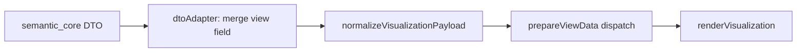

# Prepare pipeline overlap matrix

Documents how visualization payloads are shaped before `shared/diagram-renderer` `prepareViewData` runs.

## Pipeline (post-consolidation)

## Per-view matrix

| View | Rust DTO | `normalizeVisualizationPayload` | `prepareViewData` |
|------|----------|--------------------------------|-------------------|
| `general-view` | `graph` / `generalViewGraph` | Pass-through | `prepareGraph` filters diagram nodes, package groups |
| `interconnection-view` | `ibd` with `rootViews`, `rootCandidates` | Root scoring, `selectedIbdRoot`, candidate summaries (legacy UI metadata) | `prepareInterconnection` scopes via `ibd.rootViews` + `selectedViewName` |
| `action-flow-view` | `activityDiagrams` (+ graph enrichment in Rust) | Diagram ranking, performer/actionDef merge, `diagrams` alias | `prepareActivity` reads `diagrams` or `activityDiagrams` |
| `state-transition-view` | `stateMachines` (graph-first) | Server-path labels; AST fallback when `stateMachines` empty | `prepareState` / `prepareStateMachine` |
| `sequence-view` | `sequenceDiagrams` | Lifeline/message normalization, `diagrams` alias | `prepareSequence` |
| Browser / Grid / Geometry | `graph` | Pass-through | `prepareBrowser` / `prepareGrid` / `prepareGeometry` |

## Notes

- **Candidate arrays** (`activityDiagramCandidates`, `ibdRootCandidates`, etc.) are produced during normalization for tests and future selectors; webview UI uses backend `viewCandidates` today.
- **IBD root selection** exists in both normalization (extension-era scoring) and `prepareInterconnection` (`rootViews` scoping). Prefer server `rootViews` + `selectedViewName` as the long-term contract.
- **Future Rust work**: move AST state-machine fallback and activity enrichment fully into `semantic_core` so normalization becomes a thin selector (see `ACTION-STATE-BNF-SIGNOFF.md`).
