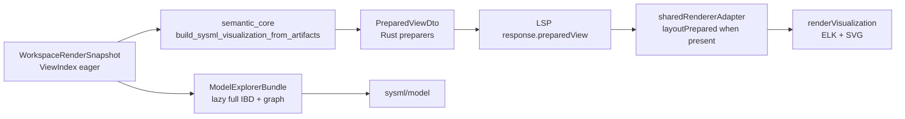

# Prepare pipeline overlap matrix

Documents how visualization payloads reach ELK layout and SVG rendering after Pass 3.

## Pipeline (Pass 3 — unified render snapshot)

## Per-view matrix

| View | Rust semantic assembly | Rust preparer | Webview |
|------|------------------------|---------------|---------|
| `general-view` | projected `graph` / `generalViewGraph` | `prepare_graph_prepared_view` | `preparedView` → layout |
| `interconnection-view` | scoped IBD + `interconnectionScene` | `prepare_interconnection_prepared_view` | `preparedView` → layout |
| `action-flow-view` | filtered `activityDiagrams` | `prepare_activity_prepared_view` | `preparedView` → layout |
| `state-transition-view` | filtered `stateMachines` | `prepare_state_prepared_view` | `preparedView` → layout |
| `sequence-view` | filtered `sequenceDiagrams` | `prepare_sequence_prepared_view` | `preparedView` → layout |
| Browser / Grid / Geometry | projected `graph` + hints | `prepare_*_prepared_view` | `preparedView` → layout |

## Notes

- **One snapshot** per `(semantic_state_version, workspace_root_uri)` replaces separate artifact/response caches. ViewIndex is eager; `PreparedView` bundles and Model Explorer IBD are lazy.
- **LSP path** attaches `preparedView` on every successful diagram response. The webview uses it directly and skips TS `prepareViewData` when present.
- **Fallback** — CLI/headless paths without `preparedView` still call TS `prepareViewData` until fully migrated.
- **IBD** — interconnection uses scoped URI merge inside projection; Model Explorer owns full-workspace IBD via `materialize_model_explorer`.
- **Candidate arrays** remain on the legacy DTO for selectors; render geometry comes from `preparedView` only on the LSP path.

## Rust modules

| Concern | Location |
|---------|----------|
| PreparedView DTO + preparers | `semantic_core/src/semantic/prepared_view/` |
| Render snapshot + ViewIndex | `semantic_core/src/semantic/render_snapshot.rs` |
| Kernel cache | `kernel/src/workspace/viz_cache.rs`, `kernel/src/views/workspace_artifacts.rs` |
| Semantic finalization (behavior) | `semantic_core/src/semantic/visualization/payload.rs` |
