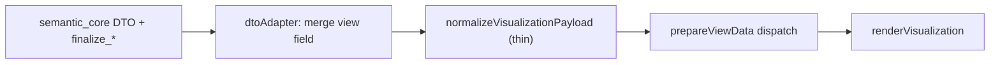

# Prepare pipeline overlap matrix

Documents how visualization payloads are shaped before `shared/diagram-renderer` `prepareViewData` runs.

## Pipeline (post-debt paydown)

## Per-view matrix

| View | Rust DTO (authoritative) | `normalizeVisualizationPayload` | `prepareViewData` |
|------|--------------------------|--------------------------------|-------------------|
| `general-view` | `graph` / `generalViewGraph` | Pass-through | `prepareGraph` filters diagram nodes, package groups |
| `interconnection-view` | `interconnectionScene` (+ optional scoped `ibd` for Model Explorer) | Pass-through when scene present; legacy empty ibd stub otherwise | `prepareInterconnection` requires `interconnectionScene` |
| `action-flow-view` | `activityDiagrams` (filtered/ranked in `visualization/payload.rs`) | `diagrams` alias + `activityDiagramCandidates` | `prepareActivity` reads `diagrams` or `activityDiagrams` |
| `state-transition-view` | `stateMachines` (labeled/sorted in `visualization/payload.rs`) | Flat `states`/`transitions` + `stateMachineCandidates` | `prepareState` / `prepareStateMachine` |
| `sequence-view` | `sequenceDiagrams` (filtered/ranked in `visualization/payload.rs`) | `diagrams` alias + `sequenceDiagramCandidates` | `prepareSequence` |
| Browser / Grid / Geometry | `graph` | Pass-through | `prepareBrowser` / `prepareGrid` / `prepareGeometry` |

## Notes

- **No AST fallback** in TypeScript normalization. Empty `stateMachines` / `activityDiagrams` on the LSP path log a dev warning from `warn_if_behavior_payload_missing`.
- **Candidate arrays** (`activityDiagramCandidates`, `stateMachineCandidates`, …) are derived in normalization for prepare/tests; webview UI uses backend `viewCandidates`.
- **IBD** — full-workspace merge stays in `WorkspaceVisualizationArtifacts`; interconnection LSP uses scoped URI build (`IbdBuildScope::ViewExposedPackages`) plus `interconnectionScene`. Slim payloads omit `ibd`.
- **Entry-node synthesis** for state machines remains in `prepare/behavior.ts` when `synthesizeInitialState: true` (not in normalization).

## Rust finalization (`semantic_core/src/semantic/visualization/payload.rs`)

| Concern | Function |
|---------|----------|
| State labels + sort + empty filter | `finalize_state_machines_for_response` |
| Action renderability + ranking + flow endpoint resolve | `finalize_activity_diagrams_for_response` |
| Sequence renderability + ranking + labels | `finalize_sequence_diagrams_for_response` |
| Incremental IBD URI closure | `ibd_uri_closure_for_exposed_ids` in `visualization/scope.rs` |
