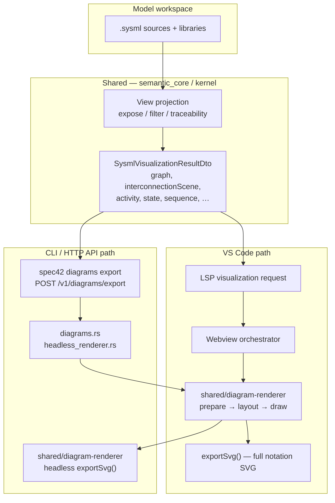

# Diagram export quality: VS Code vs CLI vs SysML v2 BNF

Date: 2026-06-16

Status: resolved architecture note (not a full OMG BNF conformance claim)

Related:

- [SHARED-DIAGRAM-RENDERER-AND-SPEC-CONFORMANCE.md](../architecture/SHARED-DIAGRAM-RENDERER-AND-SPEC-CONFORMANCE.md)
- [SYSML-NOTATION-INVENTORY.md](../reference/SYSML-NOTATION-INVENTORY.md)
- [GENERAL-IBD-BNF-SIGNOFF.md](../archive/GENERAL-IBD-BNF-SIGNOFF.md)
- [ibd-interconnection-pipeline-analysis.md](../ibd-interconnection-pipeline-analysis.md)
- [COMPETITIVE-ROADMAP.md](COMPETITIVE-ROADMAP.md)

Normative graphical reference: `SysML-v2-Release/bnf/images/` (284 SVG figures in the OMG release corpus).

## Executive summary

Spec42 has **one semantic visualization pipeline** (`semantic_core` → `SysmlVisualizationResultDto`) and now uses `shared/diagram-renderer` for publication SVG across VS Code, CLI, and HTTP API:

| Surface | Renderer | SysML v2 graphical notation | Suitable for publication |
| --- | --- | --- | --- |
| VS Code visualizer + export | `shared/diagram-renderer` (TypeScript, D3, ELK.js) | Partial — core structural and behavior views | Yes, for supported views |
| `spec42 diagrams export` and `POST /v1/diagrams/export` | Headless `shared/diagram-renderer` bundle via QuickJS | Same shipped-view notation path as VS Code | Yes, for supported views |

**CLI/API diagram export is parity with the VS Code extension for the shared renderer surface.** The SVG now contains shared renderer structure such as `viz-node--definition`, `viz-node--usage`, `viz-node--reference`, edge marker defs, compartments, IBD ports, and package/container frames. Browser, Grid, and Geometry remain provisional because their shared renderers are still partial.

The VS Code path itself is only a **partial** implementation of the full BNF figure set (~35 primary notations marked **shared** out of 284 inventory entries; many more are compartment-only or **WONTFIX**). CLI export implements **none** of that notation layer.

## Triggering incident

While adding committed SVG diagrams to the `sysml-robot-vacuum-cleaner` showcase, `spec42 diagrams export` produced very wide flat graphs (tens of thousands of pixels) with uniform rectangles (`<rect class="node">`) and no `viz-node--definition` / `viz-node--usage` chrome. The same `ModelViews` (`productStructure`, `functionalArchitecture`, `requirementsTraceability`) render correctly in the VS Code extension with nested package frames, definition vs usage borders, and relationship markers.

Those committed assets were reverted. This document records why.

## Architecture



### Shared layer (identical inputs)

All surfaces call `build_sysml_visualization_for_paths` in `kernel` / `semantic_core` with the same view id and optional `selected_view` (explicit `view` usage name from the model). The payload includes:

- `graph` / `general_view_graph` for General View and filtered variants (requirement traceability, parts tree, and so on)
- `interconnection_scene` for Interconnection View (IBD)
- `activity_diagrams`, `state_machines`, `sequence_diagrams` for behavior views
- `view_candidates` when exporting `--view model-views`

**View semantics are shared.** SVG drawing is now shared too; differences are limited to host shell behavior such as VS Code computed-style inlining and interactive zoom wiring.

### VS Code path (reference quality)

1. Extension fetches visualization via LSP (`vscode/src/visualization/modelFetcher.ts`).
2. Webview routes every `SYSML_ENABLED_VIEWS` entry through `renderSharedView()` → `shared/diagram-renderer` (`vscode/src/visualization/webview/sharedRendererAdapter.ts`). There is no legacy SysML renderer fallback.
3. Preparation (`shared/diagram-renderer/src/prepare/`) normalizes the DTO into a `PreparedView`.
4. Layout uses ELK.js in the browser (`render/layout.ts`), including hierarchical interconnection graphs, port sides, and route correction (`ibd-route.ts`).
5. Drawing applies SysML v2 chrome (`node-notation.ts`, `sysml-node-builder.ts`, `render/drawing.ts`, view modules under `views/`).
6. Export uses `controller.exportSvg()` (`shared/diagram-renderer/src/render/export.ts`) or webview `prepareSvgForExport` with computed-style inlining (`vscode/src/visualization/webview/export.ts`).

Exported SVG contains structure classes such as `viz-node--definition`, `viz-node--usage`, `viz-node--reference`, compartment text, edge markers (`general-d3-specializes`, `ibd-flow-arrow`, and so on), and package container frames for General View.

### CLI and HTTP API path (headless shortcut)

Before the headless shared-renderer migration, `crates/server/src/diagrams.rs` implemented export with a simplified Rust SVG path:

| Step | Implementation | Notes |
| --- | --- | --- |
| Payload | Same `build_sysml_visualization_for_paths` | Correct view selection |
| ELK layout | `elk_layout.rs` — vendored ELK.js inside QuickJS | Layout-only thread; options aligned with TS for interconnection |
| General / action / state SVG | `build_graph_elk_source` → flat `ElkNode` list → `render_elk_svg` | **No hierarchy nesting**; all nodes are root children |
| Interconnection SVG (production) | `render_shared_svg` → headless `preparedView` path | Same renderer as webview; no `interconnectionScene` required |
| Interconnection SVG (test-only) | `legacy_elk_svg.rs` `build_interconnection_elk_source` from `interconnectionScene` | ELK graph parity with TS input goldens; simplified drawing |
| Sequence / browser / grid / geometry | `native_svg` — vertical list of rectangles | Deterministic smoke output |
| Output markers | `data-spec42-view`, `data-layout-engine="elkjs-quickjs"` | No `viz-node--*` classes |

That legacy path drew each node as a single rounded rectangle with a name line and an element-type subtitle. Edges were plain blue orthogonal paths. It did not use `sysml-node-builder`, compartments, ports, edge markers, or package frames.

The HTTP API handler (`POST /v1/diagrams/export` in `crates/server/src/api/handlers.rs`) still calls the same `diagrams::render_diagram_for_path` function, but SVG rendering now delegates to `crates/server/src/headless_renderer.rs`, which evaluates the bundled `shared/diagram-renderer` headless entrypoint.

## Per-view comparison

| View id | Standard view type (§9.2.20) | VS Code shared renderer | CLI/API export | BNF graphical target |
| --- | --- | --- | --- | --- |
| `general-view` (+ filtered model views) | GeneralView | Hierarchical ELK, def/usage/ref chrome, compartments, relationship markers, package containers | Same headless shared renderer | Shipped-view notation |
| `interconnection-view` | InterconnectionView | Full IBD: nested usage frames, ports, connector styles (bind, flow, interface) | Same headless shared renderer | Shipped-view notation |
| `action-flow-view` | ActionFlowView | Decision/merge/assign/for-loop nodes, perform badges, conditional succession | Same headless shared renderer | Shipped-view notation; fork/join WONTFIX |
| `state-transition-view` | StateTransitionView | Regions, entry/do/exit, terminate vs final, guarded transitions | Same headless shared renderer | Shipped-view notation |
| `sequence-view` | SequenceView | Lifelines, fragments, activations, messages | Same headless shared renderer | Shipped-view notation |
| `browser-view` | BrowserView | Provisional tree | Same headless shared renderer | Partial |
| `grid-view` | GridView | Provisional table/matrix | Same headless shared renderer | Partial |
| `geometry-view` | GeometryView | Provisional 2D preview | Same headless shared renderer | Partial |

### Explicit model views (`--selected-view`)

When exporting `view productStructure : GeneralView { expose …; filter … }`:

- **VS Code** resolves the view usage, applies expose/filter/traceability projection, and renders with General View notation.
- **CLI/API** pass `selected_view` into the same projector and render the resulting graph through the headless shared renderer.

Default CLI flag `--view` is `all`; with `--selected-view` the first exportable renderer view (`general-view`) is used. This is usually correct for `GeneralView` usages but is easy to misconfigure for views that map to other renderer ids.

## Relation to SysML v2 BNF graphical notation

The OMG release ships **284** graphical figures under `bnf/images/`. Spec42 tracks them in [SYSML-NOTATION-INVENTORY.md](../reference/SYSML-NOTATION-INVENTORY.md) (generated from `SysML-v2-Release`).

Rough inventory breakdown (generated inventory, 2026-06-01):

| Status | Meaning | Count (approx.) |
| --- | --- | --- |
| **shared** | Primary notation implemented in `shared/diagram-renderer` | ~35 rows marked primary **shared** |
| **shared (compartment text only)** | Listed in compartments, not full node silhouette | Many compartment `*.svg` rows |
| **WONTFIX (not in shipped UI)** | No current product surface | ~103 rows |
| **partial / provisional** | Browser, Grid, Geometry, long-tail silhouettes | See SHARED-RENDERER-PARITY |

Sign-off checklist: [GENERAL-IBD-BNF-SIGNOFF.md](../archive/GENERAL-IBD-BNF-SIGNOFF.md) states **35 / 104 primary notations** (~34%) as **shared** for shipped General and Interconnection workflows.

### What “BNF conformant” means in practice

1. **Abstract syntax (textual model)** — Parsing and semantic validation of `view`, `viewpoint`, `expose`, `filter`, `render`, and standard view specializations (`GeneralView`, `InterconnectionView`, …). Spec42 `check` covers this; it is independent of diagram export quality.

2. **Graphical notation (BNF figures)** — How elements appear on diagrams: definition vs usage borders, port squares, specialization arrows, satisfy edges, and so on. Only the **VS Code shared renderer** targets this layer, and only partially.

3. **Rendering usages in the model** — `Views.sysml` defines `rendering asTreeDiagram`, `asInterconnectionDiagram`, `asElementTable`, and so on. Models may omit explicit `render` (`viewRendering [0..1]`). Tools choose a default renderer for the view definition kind; Spec42 maps standard view defs to renderer ids in `semantic_core`.

**CLI/API SVG now implements the same layer-2 renderer as VS Code.** Claiming full OMG BNF coverage for all 284 figures would still be incorrect; the claim is limited to shipped views and documented partial/provisional views.

### Documented vs actual CLI positioning

| Source | Claim | Reality |
| --- | --- | --- |
| [COMPETITIVE-ROADMAP.md](COMPETITIVE-ROADMAP.md) | Updated 2026-06-16: CLI SVG is partial; JSON is full DTO | See acceptance criteria in that doc |
| [conformance-metadata.json](../reference/conformance-metadata.json) | `diagram export json` → **supported**; `diagram export svg` → **supported** | SVG uses headless shared renderer; provisional views remain partial |
| [CONFORMANCE-MATRIX.md](../reference/CONFORMANCE-MATRIX.md) | Views table lists renderer **shared** | Applies to VS Code / payload contract, not CLI SVG |

Interconnection still keeps Rust ELK layout probes (`interconnection_elk_layout_matches_typescript_golden_when_present`) for internal diagnostics, but public SVG drawing uses `drawing.ts` through the headless bundle.

## Observable parity (checklist)

Use these markers to verify shared-renderer output across VS Code, CLI, and HTTP API:

| Signal | Expected SVG evidence |
| --- | --- |
| CSS classes | `viz-node--definition`, `viz-node--usage`, `viz-node--reference` |
| Node shape | Sharp vs rounded vs dotted per kind; compartments |
| Edge markers | SVG `<marker>` defs (`general-d3-specializes`, `ibd-flow-arrow`, …) |
| Package / IBD frames | `drawGeneralPackageContainers`, dashed container borders |
| Ports | IBD `port-icon` elements with side attachment metadata |
| Layout | Shared ELK layout via `shared/diagram-renderer` |
| Legacy marker absence | No `data-layout-engine="elkjs-quickjs"` simplified Rust SVG marker |

## Testing and quality gates today

| Gate | What it proves | What it does **not** prove |
| --- | --- | --- |
| `shared/diagram-renderer` Vitest | Notation chrome, IBD routing, headless export SVG structure | Rust host integration |
| `vscode/src/test/suite/*visualization*.test.ts` | LSP payload + webview export contains expected SVG fragments | CLI process invocation |
| `diagrams.rs` unit tests | `render_diagram(...Svg)` invokes headless shared renderer and emits shared markers | Full workspace coverage |
| `api_http` diagram export test | HTTP API SVG contains shared renderer markers and omits legacy layout marker | Visual pixel parity |
| `interconnection_elk_layout_matches_typescript_golden` | Internal legacy layout probe | Public drawing path |

**Remaining gap:** no pixel-level CLI-vs-VS Code screenshot diff; current gates assert structural SVG parity markers.

## Recommendations

### For Spec42 product

1. **Document honestly** — Treat SVG export as shared-renderer parity for shipped views, not full coverage of all 284 OMG BNF figures.

2. **Single drawing implementation** — Keep new notation in `shared/diagram-renderer`; do not reintroduce Rust drawing branches for public SVG.

3. **Headless bundle maintenance** — Rebuild `crates/server/assets/diagram-renderer/headless-renderer.js` after shared renderer changes using `npm run build:headless-renderer` from `vscode/`.

4. **Parity regression** — Golden test: export same fixture via webview `exportSvg` and CLI; diff structural markers (node classes, marker ids, edge types). Block release on regression for `general-view` and `interconnection-view`.

5. **JSON export as interchange** — `diagrams export --format json` remains the full DTO interchange format for custom renderers and CI probes.

### For downstream repos (showcases, CI)

1. **Use CLI/API SVG for publication** when the view is one of the shipped complete renderers.

2. **Use JSON export** when a downstream pipeline wants to render with custom themes or non-SVG targets.

3. **CI** — Use `spec42 check` for model validity and SVG export for diagram artifact generation/regression checks.

4. **README figures** — CLI/API SVG should visually match VS Code shared-renderer output for shipped views.

### Suggested conformance-metadata change (applied 2026-06-16)

`conformance-metadata.json` now splits diagram export:

```json
{
  "feature": "diagram export json",
  "status": "supported",
  "notes": "Full SysmlVisualizationResultDto; suitable for headless render with shared/diagram-renderer."
},
{
  "feature": "diagram export svg",
  "status": "supported",
  "notes": "CLI and POST /v1/diagrams/export render SVG through shared/diagram-renderer, matching the VS Code notation path for shipped views. Browser/Grid/Geometry remain provisional where their shared renderers are partial."
}
```

Regenerate with `node scripts/generate-conformance-matrix.mjs`.

## Roadmap alignment

| Work item | Effort | Impact |
| --- | --- | --- |
| Clarify docs + conformance metadata | Done | Stops false expectations |
| CLI General View hierarchical ELK input | Superseded | Headless shared renderer owns layout |
| Headless shared-renderer SVG export | Done | True CLI/editor parity |
| BNF long-tail notation in shared renderer | Ongoing | Closer to OMG figures |
| CLI vs VS Code golden parity tests | Medium | Prevents regression |

## References (code)

| Component | Path |
| --- | --- |
| CLI/API export entry | `crates/server/src/diagrams.rs` |
| Headless renderer runner | `crates/server/src/headless_renderer.rs` |
| Headless renderer bundle | `crates/server/assets/diagram-renderer/headless-renderer.js` |
| QuickJS ELK layout probes | `crates/server/src/elk_layout.rs` |
| Visualization DTO builder | `crates/semantic_core/src/semantic/visualization_workspace.rs` |
| Interconnection scene | `crates/semantic_core/src/semantic/interconnection_scene.rs` |
| Shared renderer entry | `shared/diagram-renderer/src/renderer.ts` |
| Node notation rules | `shared/diagram-renderer/src/node-notation.ts` |
| VS Code export | `vscode/src/visualization/webview/export.ts` |
| OMG standard view defs | `SysML-v2-Release/sysml.library/Systems Library/StandardViewDefinitions.sysml` |
| OMG view/render library | `SysML-v2-Release/sysml.library/Systems Library/Views.sysml` |

## Conclusion

- **VS Code, CLI, and HTTP API** now share the same SysML diagram renderer for SVG output.
- The shared renderer implements a meaningful shipped-view subset of SysML v2 graphical notation; it is not a claim of full coverage for every OMG BNF figure.
- Browser, Grid, and Geometry remain provisional until their shared renderers graduate from partial status.
