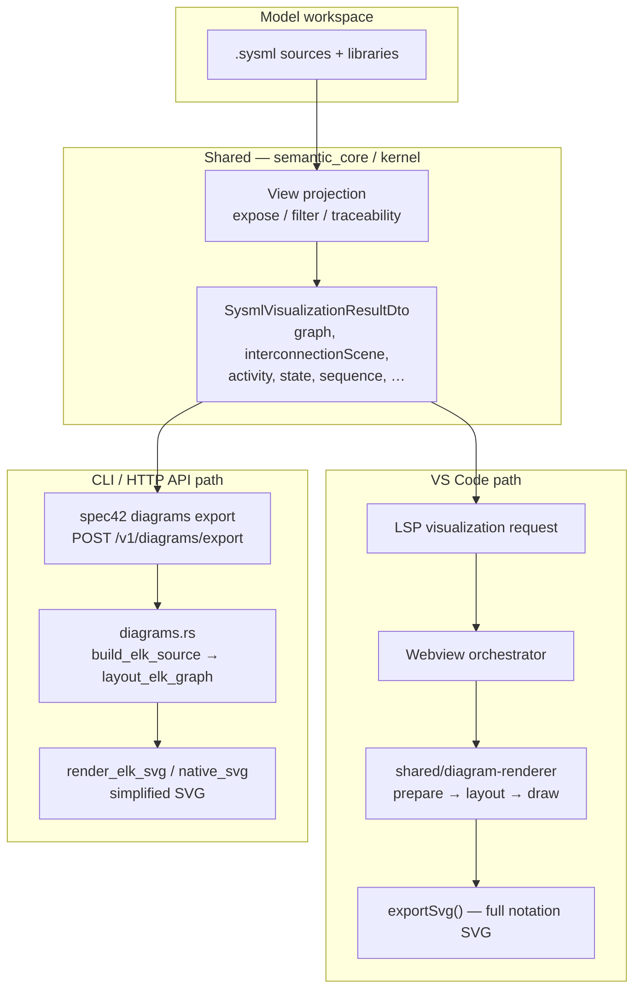

# Diagram export quality: VS Code vs CLI vs SysML v2 BNF

Date: 2026-06-16

Status: engineering analysis (not a conformance claim)

Related:

- [SHARED-DIAGRAM-RENDERER-AND-SPEC-CONFORMANCE.md](../architecture/SHARED-DIAGRAM-RENDERER-AND-SPEC-CONFORMANCE.md)
- [SYSML-NOTATION-INVENTORY.md](../reference/SYSML-NOTATION-INVENTORY.md)
- [GENERAL-IBD-BNF-SIGNOFF.md](../archive/GENERAL-IBD-BNF-SIGNOFF.md)
- [ibd-interconnection-pipeline-analysis.md](../ibd-interconnection-pipeline-analysis.md)
- [COMPETITIVE-ROADMAP.md](COMPETITIVE-ROADMAP.md)

Normative graphical reference: `SysML-v2-Release/bnf/images/` (284 SVG figures in the OMG release corpus).

## Executive summary

Spec42 has **one semantic visualization pipeline** (`semantic_core` → `SysmlVisualizationResultDto`) but **two independent SVG renderers**:

| Surface | Renderer | SysML v2 graphical notation | Suitable for publication |
| --- | --- | --- | --- |
| VS Code visualizer + export | `shared/diagram-renderer` (TypeScript, D3, ELK.js) | Partial — core structural and behavior views | Yes, for supported views |
| `spec42 diagrams export` and `POST /v1/diagrams/export` | `crates/server/src/diagrams.rs` (Rust, QuickJS ELK + simplified SVG) | No — generic boxes and blue edges | Smoke tests and layout probes only |

**CLI/API diagram export is not parity with the VS Code extension.** Public docs and conformance metadata describe CLI export as “supported” and ELK-backed, which is true for *layout*, but misleading for *graphical fidelity*. Committing CLI SVGs into downstream repos (for example README figures) will not match what users see in the editor and will not satisfy BNF graphical notation.

The VS Code path itself is only a **partial** implementation of the full BNF figure set (~35 primary notations marked **shared** out of 284 inventory entries; many more are compartment-only or **WONTFIX**). CLI export implements **none** of that notation layer.

## Triggering incident

While adding committed SVG diagrams to the `sysml-robot-vacuum-cleaner` showcase, `spec42 diagrams export` produced very wide flat graphs (tens of thousands of pixels) with uniform rectangles (`<rect class="node">`) and no `viz-node--definition` / `viz-node--usage` chrome. The same `ModelViews` (`productStructure`, `functionalArchitecture`, `requirementsTraceability`) render correctly in the VS Code extension with nested package frames, definition vs usage borders, and relationship markers.

Those committed assets were reverted. This document records why.

## Architecture



### Shared layer (identical inputs)

All surfaces call `build_sysml_visualization_for_paths` in `kernel` / `semantic_core` with the same view id and optional `selected_view` (explicit `view` usage name from the model). The payload includes:

- `graph` / `general_view_graph` for General View and filtered variants (requirement traceability, parts tree, and so on)
- `interconnection_scene` for Interconnection View (IBD)
- `activity_diagrams`, `state_machines`, `sequence_diagrams` for behavior views
- `view_candidates` when exporting `--view model-views`

**View semantics are shared.** Differences appear only after the DTO is handed to a renderer.

### VS Code path (reference quality)

1. Extension fetches visualization via LSP (`vscode/src/visualization/modelFetcher.ts`).
2. Webview routes every `SYSML_ENABLED_VIEWS` entry through `renderSharedView()` → `shared/diagram-renderer` (`vscode/src/visualization/webview/sharedRendererAdapter.ts`). There is no legacy SysML renderer fallback.
3. Preparation (`shared/diagram-renderer/src/prepare/`) normalizes the DTO into a `PreparedView`.
4. Layout uses ELK.js in the browser (`render/layout.ts`), including hierarchical interconnection graphs, port sides, and route correction (`ibd-route.ts`).
5. Drawing applies SysML v2 chrome (`node-notation.ts`, `sysml-node-builder.ts`, `render/drawing.ts`, view modules under `views/`).
6. Export uses `controller.exportSvg()` (`shared/diagram-renderer/src/render/export.ts`) or webview `prepareSvgForExport` with computed-style inlining (`vscode/src/visualization/webview/export.ts`).

Exported SVG contains structure classes such as `viz-node--definition`, `viz-node--usage`, `viz-node--reference`, compartment text, edge markers (`general-d3-specializes`, `ibd-flow-arrow`, and so on), and package container frames for General View.

### CLI and HTTP API path (headless shortcut)

`crates/server/src/diagrams.rs` implements export:

| Step | Implementation | Notes |
| --- | --- | --- |
| Payload | Same `build_sysml_visualization_for_paths` | Correct view selection |
| ELK layout | `elk_layout.rs` — vendored ELK.js inside QuickJS | Layout-only thread; options aligned with TS for interconnection |
| General / action / state SVG | `build_graph_elk_source` → flat `ElkNode` list → `render_elk_svg` | **No hierarchy nesting**; all nodes are root children |
| Interconnection SVG | `build_interconnection_elk_source` from `interconnectionScene` | ELK graph parity with TS input goldens; drawing still simplified |
| Sequence / browser / grid / geometry | `native_svg` — vertical list of rectangles | Deterministic smoke output |
| Output markers | `data-spec42-view`, `data-layout-engine="elkjs-quickjs"` | No `viz-node--*` classes |

`render_elk_svg` draws each node as a single rounded rectangle with a name line and an element-type subtitle. Edges are plain blue orthogonal paths. There is no `sysml-node-builder`, no compartments, no ports, no edge markers, no package frames.

The HTTP API handler (`POST /v1/diagrams/export` in `crates/server/src/api/handlers.rs`) calls the same `diagrams::render_diagram_for_path` function — **API export quality equals CLI export quality**.

## Per-view comparison

| View id | Standard view type (§9.2.20) | VS Code shared renderer | CLI/API export | BNF graphical target |
| --- | --- | --- | --- | --- |
| `general-view` (+ filtered model views) | GeneralView | Hierarchical ELK, def/usage/ref chrome, compartments, relationship markers, package containers | Flat ELK, generic boxes | `part-def.svg`, `part.svg`, `definition.svg`, `extended-usage.svg`, compartment figures — **shared** in VS Code only |
| `interconnection-view` | InterconnectionView | Full IBD: nested usage frames, ports, connector styles (bind, flow, interface) | Scene-based ELK + simplified boxes/edges; no port notation | `port-usage.svg`, `connection.svg`, `binding-connection.svg`, … — **shared** in VS Code only |
| `action-flow-view` | ActionFlowView | Decision/merge/assign/for-loop nodes, perform badges, conditional succession | Flat action rectangles + control-flow edges | Action-flow BNF set — **shared** in VS Code; fork/join **WONTFIX** |
| `state-transition-view` | StateTransitionView | Regions, entry/do/exit, terminate vs final, guarded transitions | Simplified state boxes | State BNF set — **shared** in VS Code |
| `sequence-view` | SequenceView | Lifelines, fragments, activations, messages | `native_svg` list layout | Sequence BNF — **shared** in VS Code |
| `browser-view` | BrowserView | Provisional tree | `native_svg` list | `asTreeDiagram` rendering kind — partial |
| `grid-view` | GridView | Provisional table/matrix | `native_svg` list | `asElementTable` / GridView — partial |
| `geometry-view` | GeometryView | Provisional 2D preview | `native_svg` list | GeometryView — partial |

### Explicit model views (`--selected-view`)

When exporting `view productStructure : GeneralView { expose …; filter … }`:

- **VS Code** resolves the view usage, applies expose/filter/traceability projection, and renders with General View notation.
- **CLI** passes `selected_view` into the same projector but renders the resulting graph with the simplified exporter. Structural relationships may appear as anonymous `contains` / `typing` edges without BNF markers.

Default CLI flag `--view` is `all`; with `--selected-view` the first exportable renderer view (`general-view`) is used. This is usually correct for `GeneralView` usages but is easy to misconfigure for views that map to other renderer ids.

## Relation to SysML v2 BNF graphical notation

The OMG release ships **284** graphical figures under `bnf/images/`. Spec42 tracks them in [SYSML-NOTATION-INVENTORY.md](../reference/SYSML-NOTATION-INVENTORY.md) (generated from `SysML-v2-Release`).

Rough inventory breakdown (generated inventory, 2026-06-01):

| Status | Meaning | Count (approx.) |
| --- | --- | --- |
| **shared** | Primary notation implemented in `shared/diagram-renderer` | ~35 rows marked primary **shared** |
| **shared (compartment text only)** | Listed in compartments, not full node silhouette | Many compartment `*.svg` rows |
| **WONTFIX (not in shipped UI)** | No current product surface | ~103 rows |
| **partial / provisional** | Browser, Grid, Geometry, long-tail silhouettes | See SHARED-RENDERER-PARITY |

Sign-off checklist: [GENERAL-IBD-BNF-SIGNOFF.md](../archive/GENERAL-IBD-BNF-SIGNOFF.md) states **35 / 104 primary notations** (~34%) as **shared** for shipped General and Interconnection workflows.

### What “BNF conformant” means in practice

1. **Abstract syntax (textual model)** — Parsing and semantic validation of `view`, `viewpoint`, `expose`, `filter`, `render`, and standard view specializations (`GeneralView`, `InterconnectionView`, …). Spec42 `check` covers this; it is independent of diagram export quality.

2. **Graphical notation (BNF figures)** — How elements appear on diagrams: definition vs usage borders, port squares, specialization arrows, satisfy edges, and so on. Only the **VS Code shared renderer** targets this layer, and only partially.

3. **Rendering usages in the model** — `Views.sysml` defines `rendering asTreeDiagram`, `asInterconnectionDiagram`, `asElementTable`, and so on. Models may omit explicit `render` (`viewRendering [0..1]`). Tools choose a default renderer for the view definition kind; Spec42 maps standard view defs to renderer ids in `semantic_core`.

**CLI export does not implement layer 2.** Claiming BNF conformance for CLI SVG would be incorrect.

### Documented vs actual CLI positioning

| Source | Claim | Reality |
| --- | --- | --- |
| [COMPETITIVE-ROADMAP.md](COMPETITIVE-ROADMAP.md) | Updated 2026-06-16: CLI SVG is partial; JSON is full DTO | See acceptance criteria in that doc |
| [conformance-metadata.json](../reference/conformance-metadata.json) | `diagram export json` → **supported**; `diagram export svg` → **partial** | Matches operational vs notation reality |
| [CONFORMANCE-MATRIX.md](../reference/CONFORMANCE-MATRIX.md) | Views table lists renderer **shared** | Applies to VS Code / payload contract, not CLI SVG |

Interconnection is the **closest** CLI parity story: Rust `build_elk_graph_from_scene` is tested against TypeScript ELK input goldens, and layout positions can match within ±2px when layout goldens exist (`interconnection_elk_layout_matches_typescript_golden_when_present`). Even there, **SVG drawing** remains the simplified `render_elk_svg` path, not `drawing.ts`.

## Observable differences (checklist)

Use these markers to identify export source:

| Signal | VS Code export | CLI/API export |
| --- | --- | --- |
| CSS classes | `viz-node--definition`, `viz-node--usage`, `viz-node--reference` | None |
| Node shape | Sharp vs rounded vs dotted per kind; compartments | Single `<rect class="node" rx="4">` |
| Edge markers | SVG `<marker>` defs (`general-d3-specializes`, `ibd-flow-arrow`, …) | `<path class="edge">` only |
| Package / IBD frames | `drawGeneralPackageContainers`, dashed container borders | Absent |
| Ports | `drawIbdPorts`, port side attachment | Absent (except unused port rects in some ELK paths) |
| Layout | Nested ELK hierarchy for General/IBD | General view: **flat** node list at root |
| Attributes | `data-layout-engine` absent or webview-specific | `data-layout-engine="elkjs-quickjs"` |
| Width on large models | Moderate; nested layout | Often extreme horizontal span (flat layered graph) |

## Testing and quality gates today

| Gate | What it proves | What it does **not** prove |
| --- | --- | --- |
| `shared/diagram-renderer` Vitest | Notation chrome, IBD routing, export SVG structure from shared renderer | CLI SVG parity |
| `vscode/src/test/suite/*visualization*.test.ts` | LSP payload + webview export contains expected SVG fragments | CLI parity |
| `diagrams.rs` unit tests | `data-element-id` preserved; interconnection ELK produces edges | BNF notation |
| `interconnection_elk_layout_matches_typescript_golden` | Layout coordinates ≈ TS | Drawing parity |
| `spec42 diagrams export` in consumer repos | Smoke: view resolves, file written | Publication quality |

**Gap:** No CI job compares CLI SVG to VS Code `exportSvg()` for the same workspace/view.

## Recommendations

### For Spec42 product

1. **Document honestly** — Treat CLI/API SVG as *layout smoke output* until parity ships. Update `conformance-metadata.json` notes (separate *operation supported* from *notation parity*).

2. **Single drawing implementation** — Preferred: headless `shared/diagram-renderer` (Node driver or WASM bundle) invoked from `diagrams export`. Alternative: port `drawing.ts` / `node-notation.ts` rules to Rust (high cost, drift risk).

3. **General view CLI** — Replace `build_graph_elk_source` flat list with the same hierarchical ELK input builder used in `shared/diagram-renderer/src/render/layout.ts` (package groups, parent/child nesting).

4. **Parity regression** — Golden test: export same fixture via webview `exportSvg` and CLI; diff structural markers (node classes, marker ids, edge types). Block release on regression for `general-view` and `interconnection-view`.

5. **JSON export as interchange** — `diagrams export --format json` already emits the full DTO; document a workflow: CI exports JSON, publication pipeline renders with shared renderer.

### For downstream repos (showcases, CI)

1. **Do not commit CLI SVG** as model documentation unless labeled *non-normative preview*.

2. **Publication** — Export from VS Code visualizer, or export JSON and render with `shared/diagram-renderer` in a script.

3. **CI** — Use `spec42 diagrams export --format json` or `spec42 check` for validation; use diagram export SVG only as a *smoke* step (file exists, non-empty, expected node count).

4. **README figures** — Prefer photos, simplified diagrams, or VS Code exports — not CLI rectangles.

### Suggested conformance-metadata change (applied 2026-06-16)

`conformance-metadata.json` now splits diagram export:

```json
{
  "feature": "diagram export json",
  "status": "supported",
  "notes": "Full SysmlVisualizationResultDto; suitable for headless render with shared/diagram-renderer."
},
{
  "feature": "diagram export svg",
  "status": "partial",
  "notes": "CLI/API simplified SVG; not shared-diagram-renderer notation. See DIAGRAM-EXPORT-QUALITY-ANALYSIS.md."
}
```

Regenerate with `node scripts/generate-conformance-matrix.mjs`.

## Roadmap alignment

| Work item | Effort | Impact |
| --- | --- | --- |
| Clarify docs + conformance metadata | Small | Stops false expectations |
| CLI General View hierarchical ELK input | Medium | Layout closer to VS Code |
| Headless shared-renderer SVG export | Large | True CLI/editor parity |
| BNF long-tail notation in shared renderer | Ongoing | Closer to OMG figures |
| CLI vs VS Code golden parity tests | Medium | Prevents regression |

## References (code)

| Component | Path |
| --- | --- |
| CLI/API export entry | `crates/server/src/diagrams.rs` |
| QuickJS ELK layout | `crates/server/src/elk_layout.rs` |
| Visualization DTO builder | `crates/semantic_core/src/semantic/visualization_workspace.rs` |
| Interconnection scene | `crates/semantic_core/src/semantic/interconnection_scene.rs` |
| Shared renderer entry | `shared/diagram-renderer/src/renderer.ts` |
| Node notation rules | `shared/diagram-renderer/src/node-notation.ts` |
| VS Code export | `vscode/src/visualization/webview/export.ts` |
| OMG standard view defs | `SysML-v2-Release/sysml.library/Systems Library/StandardViewDefinitions.sysml` |
| OMG view/render library | `SysML-v2-Release/sysml.library/Systems Library/Views.sysml` |

## Conclusion

- **VS Code** is Spec42’s reference for SysML v2 diagram *quality*; it implements a meaningful subset of BNF graphical notation via `shared/diagram-renderer`.
- **CLI and HTTP API** reuse the same *semantic* view projection but render with a separate, intentionally minimal SVG generator suitable for smoke tests and automation — **not** for human-facing model documentation or BNF conformance claims.
- Treating CLI SVG as interchangeable with the editor misrepresents the product and will confuse showcase repos, educators, and integrators.

Until headless shared-renderer export exists, any workflow that needs spec-aligned diagrams should use the VS Code export path or render from exported JSON with `shared/diagram-renderer`.
