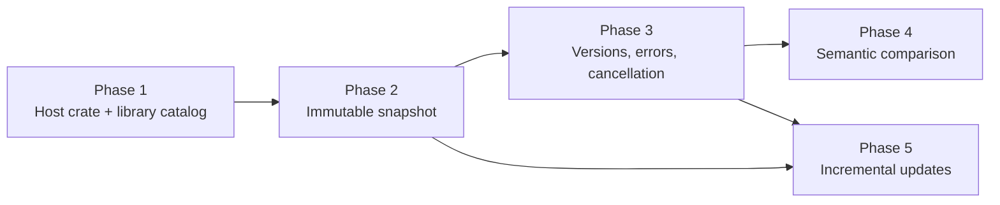

# Host embedding implementation plan

## Status

| Field | Value |
| --- | --- |
| **Status** | In progress (Phase 1 complete) |
| **Date** | 2026-06-22 |
| **Audience** | Spec42 maintainers, embedding host integrators |
| **Source** | External embedding integration spike and downstream host requirements |

This plan turns host embedding requirements into a sequenced Spec42 roadmap. Each phase should land with parity tests against existing CLI, LSP, MCP, and HTTP surfaces before the next phase starts.

## Problem statement

Embedding hosts integrate Spec42 as Rust libraries to build immutable projection artifacts for Git-native or service-hosted SysML v2 workflows. An external integration spike proved the semantic boundary is usable, but the practical integration surface still lives in the `spec42` server crate:

- `perform_check_with_semantics`
- `environment::resolve_environment`
- `diagrams::build_diagram_payload`

Hosts must currently construct a `Cli` value and depend on the server crate, which also pulls in CLI parsing, MCP, HTTP, embedded-library materialization, and headless rendering concerns that projection workers do not need.

Additional friction observed in the spike:

- passing a raw domain-library `.kpar` archive as a library path is not equivalent to passing Spec42's materialized domain-library root (8 errors and 389 warnings vs. clean validation);
- validation and view projection currently rebuild the workspace independently;
- several reusable APIs return `Result<T, String>`;
- a full robot-vacuum validation plus selected-view projection took approximately 102 seconds in a development build.

Spec42 already exposes the right internal layers (`semantic_core`, `language_service`, `kernel`), but they do not yet form one stable, protocol-neutral host API.

## Goals

1. Provide a small `spec42_host` crate with a stable embedding API for host services.
2. Make library resolution explicit, typed, and host-controlled.
3. Build each workspace once and query validation, semantic projection, language indexes, and view payloads from one immutable snapshot.
4. Version host-facing schemas and expose engine metadata for persisted artifacts.
5. Support SaaS-style workers with typed errors, cancellation, and documented concurrency contracts.

## Non-goals

- Replacing the LSP, MCP, or HTTP API as debugging and parity surfaces.
- Defining host storage, billing, or multi-tenant orchestration.
- Shipping incremental snapshot updates before the full-rebuild path is correct, measured, and shared.
- Inferring engineering impact in semantic comparison results.

## Target architecture

```text
semantic_core       — graph, resolution, diagnostics, providers, render snapshot helpers
language_service    — editor intelligence over WorkspaceSnapshot
spec42_host         — library catalog, engine builder, immutable workspace snapshot, host DTOs
kernel              — LSP/runtime adapters (implements host traits where needed)
server (spec42)     — CLI, MCP, HTTP; thin wrappers over spec42_host
```

Dependency rules:

- `spec42_host` depends on `semantic_core` and `language_service` only.
- `spec42_host` must not depend on `kernel`, `tower-lsp`, `tokio`, `clap`, `rmcp`, or Axum.
- `server` and `kernel` migrate call sites to `spec42_host` instead of duplicating environment and snapshot assembly.

### Public embedding API (target)

```rust
let engine = Spec42Engine::builder()
    .cache_dir(cache_dir)
    .library_catalog(library_catalog)
    .build()?;

let snapshot = engine.load_workspace(document_provider, HostContext::default())?;

let validation = snapshot.validation();
let projection = snapshot.semantic_projection();
let language = snapshot.language_workspace();
let views = snapshot.view_catalog();
let prepared = snapshot.prepare_view(renderer_view, selected_view)?;
```

`document_provider` is the primary workspace input. Filesystem-backed workspaces remain an adapter built on top of `SysmlDocumentProvider`.

## Implementation phases

### Phase 1 — `spec42_host` foundation and library catalog (complete)

**Objective:** replace `Cli`-shaped environment resolution with an explicit, host-neutral library catalog and engine builder.

**Deliverables**

1. Add workspace crate `crates/spec42_host`.
2. Introduce typed library inputs:
   - `LibraryArchive` (`.kpar`, embedded archive bytes)
   - `LibraryBundle` (versioned managed install)
   - `LibraryInstallRoot` (materialized tree)
   - `LibraryPackageRoots` (resolved search roots used by validation)
3. Move or re-export host-neutral resolution from:
   - `crates/server/src/environment.rs`
   - `crates/server/src/stdlib.rs`
   - `crates/server/src/domain_libraries.rs`
   - `crates/server/src/library_bundle.rs`
4. Add `LibraryCatalog` with version, content hash, and resolved package roots.
5. Add `Spec42Engine::builder()` accepting:
   - explicit `cache_dir` (optional; no implicit user-profile writes in server mode);
   - embedded stdlib/domain features as optional builder methods;
   - extra library paths and pre-resolved catalogs.
6. Keep `server::resolve_environment(&Cli)` as a thin adapter over the new builder for backward compatibility.

**Acceptance criteria**

- Embedding hosts can depend on `spec42_host` instead of constructing a fake `Cli`.
- Archive vs. materialized-root behavior is covered by unit tests reproducing the spike mismatch.
- `spec42 doctor` and `spec42 check` produce identical library resolution results before and after the refactor.
- `spec42_host` compiles without `clap`, `rmcp`, or HTTP dependencies.

**Primary files**

| Area | Current location | Action |
| --- | --- | --- |
| Environment resolution | `crates/server/src/environment.rs` | extract host-neutral core |
| Standard library | `crates/server/src/stdlib.rs` | move materialization behind catalog trait |
| Domain libraries | `crates/server/src/domain_libraries.rs` | typed archive/root resolution |
| Library bundles | `crates/server/src/library_bundle.rs` | shared with host catalog |
| New crate | `crates/spec42_host/` | public embedding API |

**Suggested issues**

- `spec42_host`: add crate skeleton and dependency guardrails
- `spec42_host`: typed library catalog and explicit cache directory
- `server`: adapt `resolve_environment` to `spec42_host`

### Phase 2 — Immutable workspace snapshot

**Objective:** one workspace build powers validation, semantic projection, language-service queries, and view preparation.

**Deliverables**

1. Add `HostWorkspaceSnapshot` in `spec42_host`:
   - parsed documents and per-document content hashes;
   - semantic graph and diagnostics;
   - `language_service::InMemoryWorkspace` or equivalent `WorkspaceSnapshot` implementation;
   - `WorkspaceRenderSnapshot` / view index from `semantic_core`;
   - `HostSnapshotMetadata` with engine version and build timestamps.
2. Add `Spec42Engine::load_workspace(provider, context)` returning `Arc<HostWorkspaceSnapshot>`.
3. Refactor:
   - `perform_check_with_semantics`
   - `diagrams::build_diagram_payload`
   into snapshot queries rather than independent rebuilds.
4. Add filesystem workspace adapter that scans a root into a `SysmlDocumentProvider`.
5. Add in-memory changeset adapter accepting added/changed/removed logical document URIs.

**Acceptance criteria**

- Robot-vacuum showcase validates and prepares `ModelViews::productStructure` from one snapshot build.
- Host embedding integration elapsed time improves measurably by eliminating duplicate environment resolution and graph rebuild; record dev and release timings in the plan issue.
- Snapshot types are `Send + Sync` and cheap to share through `Arc`.
- Existing `language_service` headless tests continue to pass without behavior changes.

**Primary files**

| Area | Current location | Action |
| --- | --- | --- |
| Validation with semantics | `crates/server/src/lib.rs` | delegate to snapshot builder |
| Diagram payload | `crates/server/src/diagrams.rs` | query existing snapshot |
| Render snapshot | `crates/semantic_core/src/semantic/render_snapshot.rs` | consumed by host snapshot |
| In-memory workspace | `crates/language_service/src/workspace.rs` | integrated into host snapshot |

**Suggested issues**

- `spec42_host`: immutable workspace snapshot type
- `spec42_host`: single-build validation and view projection
- `spec42_host`: in-memory document provider adapter

### Phase 3 — Version metadata, structured errors, and execution context

**Objective:** make persisted artifacts reproducible and embedding-safe for SaaS workers.

**Deliverables**

1. Add `HostSchemaVersions` and `HostArtifactMetadata` containing:
   - Spec42 crate/engine version;
   - projection schema version;
   - renderer compatibility version;
   - library catalog version and content hash;
   - source document identity hashes.
2. Replace `Result<T, String>` on host-facing APIs with `Result<T, Spec42HostError>` using stable error codes:
   - `invalid_document_uri`
   - `parser_failure`
   - `unresolved_library_environment`
   - `unsupported_view`
   - `cancelled`
   - `resource_limit_exceeded`
   - `internal_invariant_failure`
3. Add `HostContext` with:
   - cancellation token;
   - deadline;
   - maximum document count and bytes;
   - optional node/relationship materialization limits;
   - progress callback by pipeline phase.
4. Ensure cancellation returns a typed `Cancelled` outcome and never marks partial results as complete.
5. Document `Send`, `Sync`, clone, and reuse rules for engine, catalog, snapshot, and query handles.

**Acceptance criteria**

- Snapshot JSON metadata round-trips through serde tests.
- Host-facing APIs no longer expose `String` errors at the public boundary.
- Cancellation is covered by at least one integration test on a intentionally slow workspace fixture.
- Concurrency contract is written in `crates/spec42_host/README.md`.

**Suggested issues**

- `spec42_host`: versioned artifact metadata
- `spec42_host`: structured host errors
- `spec42_host`: execution context, cancellation, and limits

### Phase 4 — Semantic comparison API

**Objective:** compare two immutable revisions without re-deriving identity semantics in the embedding host.

**Deliverables**

1. Add `compare_snapshots(previous, next) -> SemanticComparisonReport`.
2. Report:
   - added, removed, and changed model elements;
   - added and removed relationships;
   - introduced and resolved diagnostics;
   - changed supported-view payload identities;
   - explicit `identity_preservation` status when stable IDs cannot be carried across revisions.
3. Version `SemanticComparisonReport` in `HostSchemaVersions`.
4. Keep comparison facts semantic only; no inferred engineering impact.

**Acceptance criteria**

- Comparison tests cover element add/remove, relationship change, diagnostic churn, and view identity change.
- Embedding hosts can persist comparison output as a versioned artifact without post-processing node arrays.

**Suggested issues**

- `spec42_host`: semantic snapshot comparison API
- `spec42_host`: comparison schema versioning

### Phase 5 — Incremental snapshot updates

**Objective:** reduce interactive rebuild cost after the full-build path is stable.

**Deliverables**

1. Add `Spec42Engine::update_snapshot(previous, changes, context) -> Arc<HostWorkspaceSnapshot>`.
2. Support added, changed, and removed logical document URIs through `DocumentChanges`.
3. Preserve immutability: published snapshots are never mutated.
4. Reuse unchanged library catalog state and any safe intermediate indexes where correctness allows.
5. Add benchmarks comparing full rebuild vs. single-document update on robot-vacuum and a medium synthetic workspace.

**Acceptance criteria**

- Single-document edits produce identical diagnostics and projection results to full rebuild for covered fixtures.
- Incremental path is feature-gated or clearly marked experimental until benchmark targets are met.
- Host editor integration can request navigation and diagnostics after one changed document without full workspace ownership on disk.

**Suggested issues**

- `spec42_host`: incremental snapshot update API
- `spec42_host`: incremental rebuild benchmarks

## Parity and regression strategy

Every phase must keep existing external behavior stable unless a breaking host API change is explicitly versioned.

| Surface | Role | Required parity |
| --- | --- | --- |
| `spec42 check --format json` | CLI baseline | validation counts and semantic projection |
| `spec42 doctor` | library diagnostics | resolved roots and source kinds |
| HTTP `/v1/validate` and related routes | service baseline | same payloads as CLI where applicable |
| MCP `spec42_model_summary` | assistant baseline | semantic summary fields |
| `spec42_host` embedding integration tests | embedding baseline | end-to-end validation and selected view |
| `language_service` tests | editor baseline | navigation, completion, rename, outline |

Add `crates/spec42_host/tests/` for:

- library archive vs. install-root equivalence;
- snapshot single-build invariants;
- metadata and error round-trips;
- comparison fixtures;
- optional ignored showcase tests behind `SYSML_ROBOT_VACUUM_DIR`.

The read-only HTTP API remains useful for manual debugging and automated parity checks. It is not the production multi-tenant boundary for in-process embedding hosts.

## Suggested delivery order



Phases 1 and 2 are the critical path for host embedding MVP. Phase 3 should start as soon as snapshot construction exists. Phases 4 and 5 can overlap once metadata and error contracts are stable.

## Risks and mitigations

| Risk | Mitigation |
| --- | --- |
| `spec42_host` becomes a second abstraction layer | extract from `server`, do not duplicate pipeline logic; make `server` a consumer |
| Public schema versioning is hard to change later | introduce `HostSchemaVersions` in Phase 3 before hosts persist production artifacts |
| Incremental updates are correctness-sensitive | ship only after full-build parity tests and benchmarks; keep full rebuild as fallback |
| Library materialization still writes to profile dirs | require explicit `cache_dir` or read-only catalog in server embedding mode |
| Dependency bloat for embedders | enforce crate-level dependency guardrails similar to `language_service` |

## Documentation follow-ups

Phase 1 complete:

1. ADR [0003](../adr/0003-spec42-host-embedding-crate.md) accepted.
2. [DEVELOPMENT.md](../../DEVELOPMENT.md) workspace layout updated.
3. `crates/spec42_host/README.md` documents cache and concurrency contracts.

Remaining for Phase 2:

1. Update [SEMANTIC_CORE_ARCHITECTURE.md](../architecture/SEMANTIC_CORE_ARCHITECTURE.md) consumer boundaries for `spec42_host` snapshots.

Phase 2 complete:

1. `HostWorkspaceSnapshot` with single-build validation, projection, language-service workspace, and view catalog.
2. `Spec42Engine::load_workspace` and filesystem/changeset document providers.
3. Server `perform_check_with_semantics` and diagram export query one snapshot build.
4. Kernel `semantic_report_from_built_workspace` preserves CLI diagnostic parity on pre-built graphs.
5. Integration tests: `snapshot_single_build`, `built_workspace_parity`, `robot_vacuum_snapshot` (ignored).

## Related documents

- [ADR 0003: `spec42_host` crate](../adr/0003-spec42-host-embedding-crate.md)
- [ADR 0002: `language_service` crate](../adr/0002-language-service-crate.md)
- [Standard library resolution guide](STDLIB-RESOLUTION-GUIDE.md)
- [Semantic core architecture](../architecture/SEMANTIC_CORE_ARCHITECTURE.md)
