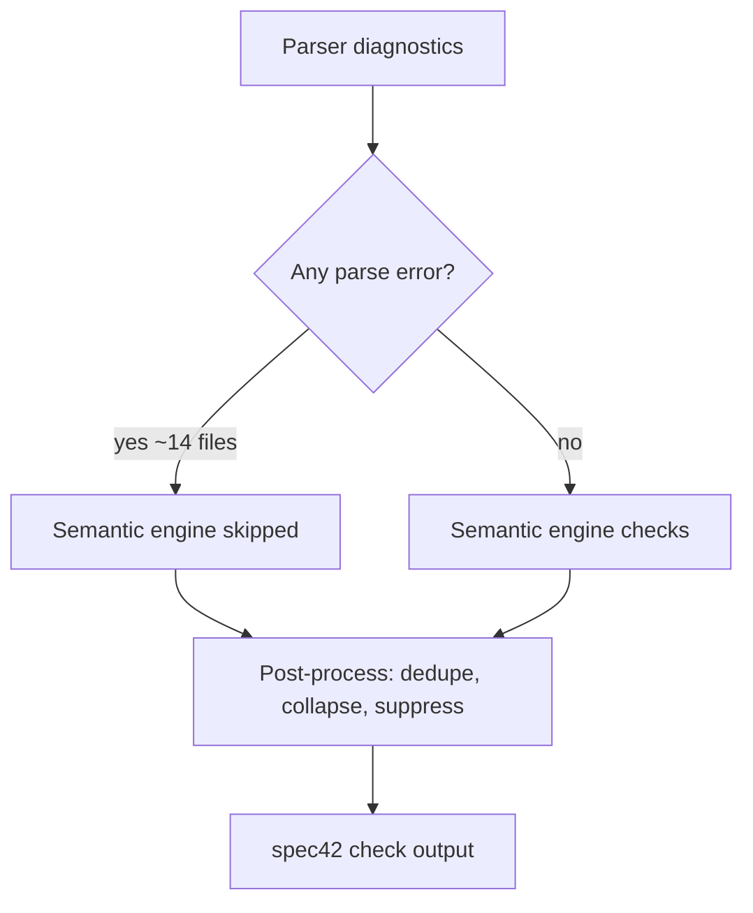

# MBSE Vacuum-Cleaner Example: `spec42 check` Analysis

**Corpus:** `C:\Git\MBSE_AG_vacuum-cleaner-robot-example`  
**Command:** `spec42 check` (workspace scan, embedded standard library)  
**Date:** June 2026  
**Documents checked:** 52  

## Executive summary

| Severity | Count |
|----------|------:|
| Error | 20 |
| Warning | 136 |
| Info | 10 |
| **Total** | **166** |

The corpus is a mix of modern SysML v2 solution-space models and legacy v1-style fragments. Many reported issues are **genuine modeling or syntax problems**, but the signal is heavily distorted by:

1. **Over-reporting** — especially `visibility_violation` (75 warnings) on normal `private import …::*` usage that is allowed by SysML v2.
2. **Under-reporting** — diagnostic suppression when a file has any parse error (semantic engine skipped, cascade errors collapsed to one per file).

Roughly **half of all warnings** come from a single Spec42 policy check that does not reflect a SysML v2 spec violation.

---

## Diagnostic distribution

| Code | Count | Assessment |
|------|------:|------------|
| `visibility_violation` | 75 | Mostly **false positives** (Spec42 policy) |
| `unresolved_type_reference` | 13 | Mix of real issues and import resolution |
| `port_type_mismatch` | 12 | Mostly real (homonymous port defs) |
| `flow_direction_incompatible` | 9 | Mostly real |
| `untyped_part_usage` | 7 | Informational heuristic |
| `recovered_part_usage_body_element` | 7 | Valid v2 `redefines` syntax; **parser gaps** (see below) |
| `unresolved_import_target` | 4 | Real (missing packages) |
| `analysis_evaluation_unresolved` | 4 | Expected without analysis execution |
| `invalid_bare_identifier_in_state_body` | 4 | Parser strictness / gray area |
| `unresolved_connection_segment` | 3 | Real naming / structure issues |
| `missing_final_state` | 3 | Conformance hint (info) |
| `duplicate_namespace_member` | 3 | Likely **false positives** |
| `unresolved_pending_expression_relationship` | 3 | Real connection resolution failures |
| Other (≤2 each) | 14 | See sections below |

---

## Errors (20)

### Likely valid (model or SysML v2 syntax)

| Code | Files / pattern | Notes |
|------|-----------------|-------|
| `recovered_part_usage_body_element` (7) | `port redefines …;`, `part tire1 redefines motorTire[1];` | **Valid SysML v2** (`redefines` and `:>>` are equivalent per spec §7.6). Parser does not yet accept all forms (e.g. multiplicity after a `redefines` clause, `part redefines X` without `:>>`, nested `port redefines` in part usage bodies). |
| `invalid_requirement_short_name_syntax` (1) | `SystemLevel/DriveUnit.sysml` — `requirement def id 'Req001' …` | Standard form is `requirement def <'Req001'> …`. |
| `missing_closing_brace` (1) | `Functions/legacy/VacuumingSystem/VacuumingTypes.sysml` | Brace imbalance or recovery artifact. |
| `incompatible_type_kind` (2) | `actor controller : RoboticVacuumCleaner` | Actors should be typed by actor definitions, not part types. |
| `unresolved_pending_expression_relationship` (3) | `NavigationSystem.sysml`, `RobotVacuum.sysml` | Unresolved connection endpoints (`engine.pwmInputPort`, `dirtyAirFlow`, etc.). |

**Example (valid v2 redefines — parser gap, not dialect):**

```sysml
part motor1 : dcMotor {
    part tire1 redefines motorTire[1];  // valid: keyword redefines or :>> (SysML v2 §7.6)
}
part redefines cylinders[4];            // valid redefines-only form (spec Fig. 7.6)
port redefines rotationSpeedIn;         // valid inside part bodies
```

**Example (requirement short name):**

```sysml
requirement def id 'Req001' MaximaleMasse { … }   // non-standard
requirement def <'Req001'> MaximaleMasse { … }     // standard
```

### Parser / tooling gaps (model may be allowed in v2)

| Code | Example | Notes |
|------|---------|-------|
| `missing_body_or_semicolon` (2) | `Battery.sysml:37` — nested `part def Cell { … }` inside `part def Accumulator` | Nested **`part def` in `part def`** is not yet supported in `sysml-v2-parser` (same class of gap as nested `item def`, which was fixed separately). Inner members like `capacity : Real` without `attribute` are also invalid v2 syntax. |
| `invalid_bare_identifier_in_state_body` (4) | `entry act { batCap; maxBatCap; computedColor; }` | Bare identifiers in state/action bodies are rejected by the parser. Whether shorthand perform/bind notations are valid depends on intended v2 surface syntax — **gray area**. |

**Example (`Battery.sysml`):**

```sysml
part def Accumulator {
    item def Energy;          // OK after parser fix
    attribute mass : Real;
    part def Cell {           // parse error: nested part def not supported
        capacity : Real;      // also missing `attribute` keyword
        voltage : Real;
    }
}
```

### Semantic graph gaps (model may be OK)

| Code | Example | Notes |
|------|---------|-------|
| `unresolved_pending_relationship` (2) | Use-case succession in `VRS_UseCases.sysml` | Flow from `Vacuming` to `Vacuming::start` not materialized in the semantic graph. |

---

## Warnings — signal vs. noise

### `visibility_violation` (75) — primary noise source

**Pattern (throughout corpus):**

```sysml
private import ScalarValues::*;
private import RobotPortDefs::*;
```

**Spec42 message:** *"Import of '…::*' is private but re-exports an entire namespace; use public import when exposing imported members."*

**SysML v2 spec:** `private import` means imported memberships are **not visible outside** the importing namespace. It does **not** forbid private wildcard imports for **internal** use. This pattern appears throughout OMG examples and domain libraries.

**Conclusion:** These warnings reflect **Spec42 policy**, not SysML v2 violations. They dominate the report and should be narrowed (e.g. only warn on actual re-export scenarios).

### `duplicate_namespace_member` (3) — likely false positives

Examples:

- *"Namespace 'Navigation' declares 'def' 2 times"*
- *"Namespace 'dcMotor' declares 'def' 3 times"*

The models contain distinct members such as `action def DoNavigate` and `action def FindHome`. The checker appears to count a spurious member name `'def'` — likely a **graph naming bug**, not a modeling error.

### `unresolved_type_reference` (13) — mixed

| Cause | Example |
|-------|---------|
| Wrong / unqualified name | `part engine[2] : Engine` when type does not resolve |
| Missing package in corpus | `VRSA::Battery`, `BaseArchitecture::VacuumCleaner` |
| Import resolution | `Real`, `Boolean` in legacy files despite `ScalarValues` import (may interact with private-import handling) |

### Port and flow warnings (23 total)

Codes: `port_type_mismatch`, `flow_direction_incompatible`, `flow_item_type_incompatible`, `conjugated_port_inconsistent`.

These often indicate **homonymous port definitions** from different packages, e.g.:

- `ControllerSystem_Controller::DriverUnitControlPort`
- `Controller::DriverUnitControlSignal`

Same short name, incompatible definitions — **legitimate architectural / import issues**, not parser bugs.

### `analysis_evaluation_unresolved` (4)

Requirement constraints that cannot be evaluated in `check` without a full analysis context. Informational quality issue, not a syntax error.

### `missing_final_state` (3, info)

Spec42 conformance hint referencing SysML 7.18.3 (finality indicators). Reasonable as guidance, not a hard syntax violation.

---

## Diagnostic suppression

`spec42 check` applies several layers that shape what users see. **Suppression is aggressive in some places and insufficient in others.**



### 1. Semantic engine disabled on parse error

In `crates/kernel/src/analysis/diagnostics_core.rs`, when `block_on_any_parse_issue` is false (CLI `check` default), **any parser error** disables the full semantic diagnostic engine. Only lightweight heuristics (e.g. `untyped_part_usage`) still run.

**Effect:** Files with parse errors do not report semantic warnings (`visibility_violation`, `unresolved_type_reference`, port checks, etc.) even when later lines might still be analyzable.

### 2. One parse error per file (cascade collapse)

`crates/kernel/src/analysis/diagnostics_postprocess.rs` — `collapse_cascade_parse_diagnostics`:

- At most **one** top-level parse error per file.
- Recovery / cascade codes are dropped or moved to `relatedInformation`.

**Effect:** A file like `BrushSystem.sysml` shows a single line; other broken constructs in the same file are hidden.

### 3. Semantic suppression after first parse error (CLI only)

`suppress_semantic_after_parse_error: true` for validation CLI (default for `check`, **not** for LSP):

- Shadowable codes (`unresolved_type_reference`, `unresolved_import_target`, etc.) on lines **at or after** the first parse error line are filtered out.

**Effect:** CLI and IDE can disagree on diagnostics for the same file.

### 4. Parser-side cascade suppression

`sysml-v2-parser` also suppresses some recovery cascades (`recovery_cascade_suppressed`) before Spec42 post-processing.

### Suppression balance

| Direction | Issue |
|-----------|-------|
| **Too much suppression** | Parse error → no semantic pass; one error per file; filtered `unresolved_*` after parse errors |
| **Too much noise** | 75× `visibility_violation` on standard private wildcard imports |
| **Too little precision** | Parser gaps (nested `part def`, action-body shorthand) surface as generic parse errors |
| **False positives** | `duplicate_namespace_member` reporting member name `'def'` |

---

## Files with parse errors (semantic pass skipped)

These files contribute **errors only** (no semantic warnings from the main engine):

| File | Primary code |
|------|----------------|
| `Solution Space/EnergySupplySystem/Battery.sysml` | `missing_body_or_semicolon` |
| `legacy/EnergySupplySystem/Battery.sysml` | `missing_body_or_semicolon` |
| `Solution Space/VacuumingSystem/BrushSystem.sysml` | `recovered_part_usage_body_element` |
| `Solution Space/VacuumingSystem/SuctionDevice.sysml` | `recovered_part_usage_body_element` |
| `legacy/NavigationSystem/DriveUnit.sysml` | `recovered_part_usage_body_element` |
| `legacy/VacuumingSystem/BrushSystem.sysml` | `recovered_part_usage_body_element` |
| `legacy/VacuumingSystem/FilterSystem.sysml` | `recovered_part_usage_body_element` |
| `legacy/VacuumingSystem/SuctionDevice.sysml` | `recovered_part_usage_body_element` |
| `legacy/VacuumingSystem/VacuumingSystem.sysml` | `recovered_part_usage_body_element` |
| `legacy/VacuumingSystem/VacuumingTypes.sysml` | `missing_closing_brace` |
| `Integration.sysml` (×2 paths) | `invalid_bare_identifier_in_state_body` |
| `BatteryLevelComputer.sysml` (×2 paths) | `invalid_bare_identifier_in_state_body` |
| `SystemLevel/DriveUnit.sysml` | `invalid_requirement_short_name_syntax` |

---

## Spec alignment summary

| Category | Verdict |
|----------|---------|
| `redefines` keyword (equivalent to `:>>`) | **Valid** in SysML v2 textual notation (§7.6); parser support incomplete |
| `private import X::*` for internal use | **Valid**; Spec42 warnings are **not** spec-backed |
| Nested `part def` / `item def` in `part def` | **Valid** in metamodel; parser support incomplete |
| `actor` typed by `part def` | **Invalid** usage kind |
| Homonymous port defs across imports | **Real** interconnection problems |
| `id 'Req001'` requirement syntax | **Non-standard** dialect |
| Bare identifiers in state entry actions | **Gray area** — parser rejects; spec intent unclear from text alone |

---

## Implementation status (June 2026)

| Item | Status |
|------|--------|
| Remove false-positive `visibility_violation` on `private import ::*` | Done |
| Fix `duplicate_namespace_member` `'def'` collision (opaque `action def` + legacy `requirement def id` naming) | Done |
| Nested `part def` in `part def` body (parser + semantic graph) | Done |
| Default `spec42 check`: semantic checks despite parse errors | Done |
| `--strict-diagnostics` escape hatch for legacy quiet reports | Done |
| Per-code vacuum baseline (`MBSE_VACUUM_EXAMPLE_DIR`) | Done |
| `redefines` keyword parsing (`part` / `port` / `attribute` usages, sysml-v2-parser 0.20.4) | Done |

## Remaining follow-ups

1. `invalid_bare_identifier_in_state_body` — needs BNF/spec decision for action-body shorthand.
2. `unresolved_pending_relationship` for use-case flows — semantic graph feature gap.
3. Optional `--show-all-parse-errors` if single-error collapse hides too much.
4. `out attribute redefines …` in port/interface def bodies — direction prefix + redefines (e.g. VacuumingTypes.sysml).

---

## References

- Diagnostic pipeline: `docs/engineering/DIAGNOSTIC-CHECKS-ROADMAP.md`
- Post-processing: `crates/kernel/src/analysis/diagnostics_postprocess.rs`
- CLI workflow: `DEVELOPMENT.md` (Diagnostic quality workflow)
- Parser feedback (cross-repo): `sysml-v2-parser/docs/CORPUS_MBSE_VACUUM_PARSER_SPEC42_FEEDBACK.md` (when present)
