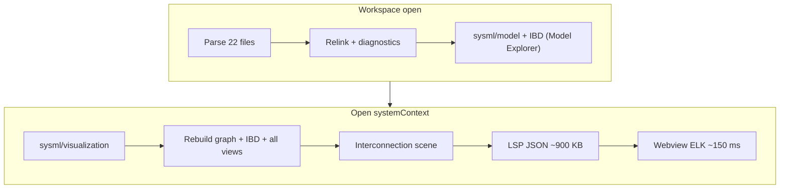

# Power Systems Performance Analysis

Analysis of loading a regional grid expansion fixture workspace and opening the `systemContext` interconnection diagram. Captures measurements from March 2026 profiling on Windows (x86_64).

## Scenario

| Item | Value |
|------|-------|
| Workspace | External grid fixture checkout via `SYSML_POWERSYSTEMS_DIR` (22 SysML files, ~78 KB in the March 2026 run) |
| Diagram | `systemContext` (`interconnection-view`) |
| Diagram size | 20 parts, 19 connectors, 19 scene edges |
| User path | VS Code: open folder → Model Explorer indexes → open visualizer → select `systemContext` |

## Executive summary

Slowness is **not** caused by ELK layout or SVG rendering (~150 ms). Almost all time is spent in **Rust building visualization DTOs**, especially **IBD construction and merging** (~3 s per visualization build in release; duplicated across Model Explorer and visualizer). VS Code feels slower than CLI because it runs the debug server under F5 (~3–5×), repeats heavy work on startup, and ships large JSON payloads over LSP.

## Measurements

### Release CLI (`spec42 diagrams export`)

| Metric | Value |
|--------|------:|
| Total wall time | ~8.5 s |
| `modelBuildTimeMs` (payload stats) | 8,429 ms |
| Response size (JSON) | ~1.3 MB |
| Graph in payload | 251 nodes, 310 edges |
| Webview ELK layout | ~150 ms |

### Debug vs release binary

| Build | `systemContext` export |
|-------|----------------------:|
| `target/release/spec42.exe` | ~8.5 s |
| `target/debug/spec42.exe` | ~29–47 s |

F5 **Launch Extension** stages `target/debug/spec42.exe` by default.

### Automated drill-down test (debug test profile, cached LSP graph)

Run locally:

```powershell
# In-repo CI smoke (always available)
cargo test -p kernel --test lsp_integration integration::powersystems_performance::drone_interconnection_performance_smoke_report -- --nocapture

# Optional grid drill-down (external checkout)
cargo test -p kernel --test lsp_integration integration::powersystems_performance::powersystems_system_context_performance_report -- --ignored --nocapture
```

Requires `SYSML_POWERSYSTEMS_DIR` for the grid drill-down only (not bundled with spec42). Reports written to `target/spec42-perf/drone-interconnection-performance.json` and `target/spec42-perf/grid-system-context-performance.json`.

**Phase breakdown** (in-process, semantic graph already built):

| Phase | ms | Notes |
|-------|---:|-------|
| `ibdPerUri` | 1,705 | `build_ibd_for_uri` × 22 files |
| `ibdMergeFinalize` | 1,485 | merge + `finalize_merged_ibd_connectors` |
| `fullVisualizationWorkspace` | 3,561 | full `build_sysml_visualization_workspace` |
| `evaluateViews` | 111 | 8 explicit views |
| `projectAllViews` | 72 | per-view ID projection |
| `interconnectionScene` | 4 | scene for `systemContext` only |
| `workspaceGraphDto` | 29 | workspace graph projection |
| `semanticGraphBuild` | 733 | cold parse + graph (one-time) |

**LSP path** (mirrors VS Code after indexing):

| Step | ms | Notes |
|------|---:|-------|
| Startup relink | 446 | cross-doc edges, relationships |
| Startup diagnostics | 2,924 | all workspace files (debug test profile) |
| `sysml/model` (Model Explorer) | 2,943 | **1 ms IBD** (artifact cache hit); **3.2 MB** response |
| `sysml/visualization` (`systemContext`, first) | 151 | **147 ms** model build; **preparedView-first slim payload** (~50 KB class for interconnection) |
| `sysml/visualization` (`systemContext`, cache hit) | 2 | response cache; **47 ms** LSP round-trip |

### Pre-change baseline (March 2026, for comparison)

| Step | ms | Notes |
|------|---:|-------|
| Startup relink | 481 | cross-doc edges, relationships |
| Startup diagnostics | 612 | all workspace files |
| `sysml/model` (Model Explorer) | 1,196 | includes **855 ms IBD**; **3.0 MB** response |
| `sysml/visualization` (`systemContext`) | 3,632 | **3,562 ms** model build; **911 KB** response |

### VS Code overhead (estimated)

| Factor | Impact |
|--------|--------|
| Debug server under F5 | 3–5× on all Rust phases |
| Duplicate IBD build (explorer + visualizer) | ~1–3 s release, ~5–15 s debug |
| Startup indexing before diagram | ~0.5–1 s release relink + diagnostics |
| JSON clone in extension (`toWebviewUpdateMessage`) | minor vs Rust |
| Webview prepare + ELK | &lt;1 s |

**Estimated VS Code total (F5 debug):** ~60–90 s from folder open to rendered `systemContext`.

**Estimated VS Code total (release server):** ~15–25 s.

## Architecture: where time goes



**Before optimization**, `build_sysml_visualization_workspace` always:

1. Built the full workspace graph DTO (251 nodes for the selected view projection; 1,086 nodes for workspace model).
2. Built and merged IBD for **every** workspace URI.
3. Evaluated and projected **all 8** explicit views.
4. Built activity/sequence/state payloads even when only interconnection was requested.

**After optimization (June 2026)**:

1. **Workspace artifact cache** (`WorkspaceVizCaches` on `ServerState`): graph + merged IBD + evaluated views + view candidates, keyed by `semantic_state_version` and normalized workspace root. Shared by `sysml/model` and `sysml/visualization`.
2. **Lazy single-view projection**: only the selected view is projected; activity/sequence/state are skipped for interconnection-only paths.
3. **Visualization response cache**: per `(version, root, view, selectedView)`; warm repeat requests return in ~2 ms Rust work.
4. **Slim interconnection payload**: now centers on `preparedView` + selectors and omits duplicate semantic scene/model fields for interconnection LSP responses.

## Bottleneck ranking

1. **IBD build + merge** (~3.2 s of ~3.6 s visualization build) — dominant cost; run twice per VS Code session (explorer + visualizer).
2. **Debug binary in development** — multiplies all Rust work.
3. **O(all views) visualization pipeline** — projects 8 views when only one is shown.
4. **Large LSP payloads** — 3 MB workspace model + 900 KB visualization; JSON serialization on stdio.
5. **Startup diagnostics** — 612 ms for 22 files (acceptable alone, adds to perceived latency).
6. **Webview/ELK** — not a bottleneck for this scenario.

## Improvement plan

### P0 — Quick wins (days) — **implemented**

| # | Change | Status |
|---|--------|--------|
| 1 | Document `spec42.serverPath` → release binary for dev | Done — see [DEVELOPMENT.md](../../DEVELOPMENT.md) and F5 `launch.json` comment |
| 2 | **Cache visualization result** in LSP keyed by `(semantic_state_version, view, selectedView)` | Done — `build_visualization_with_cache` |
| 3 | **Skip IBD in `sysml/visualization`** when response already has `interconnectionScene` from cache | Done — response cache |

### P1 — Structural (1–2 weeks) — **implemented**

| # | Change | Status |
|---|--------|--------|
| 4 | **Lazy view pipeline**: build graph + IBD once per `semantic_state_version`; project only the selected view | Done — `build_sysml_visualization_from_artifacts` |
| 5 | **Share IBD between `sysml/model` and `sysml/visualization`** via server-side cache | Done — `ensure_workspace_artifacts` |
| 6 | **Slim visualization payload**: omit full workspace graph / unused view candidates for interconnection path | Done — `VisualizationBuildOptions::slim_interconnection_payload` |
| 7 | Add **phase timing** to `backend:sysmlVisualizationRequest` (`ibdMs`, `viewEvalMs`, `sceneMs`, `cacheHit`) | Done |

### P2 — Broader (backlog)

| # | Change | Expected impact | Effort |
|---|--------|-----------------|--------|
| 8 | Incremental IBD: scope to exposed packages for selected view | Reduce `ibdPerUri` from 22 files to 2–3 | **Implemented** — `IbdBuildScope::ViewExposedPackages` |
| 9 | Parallel IBD in visualization path (already done for `sysml/model` workspace scope) | ~2× on IBD phase | Medium |
| 10 | Nightly CI: interconnection perf smoke on in-repo drone example; optional grid drill-down | Regression guard | **Done** — `drone_interconnection_performance_smoke_report` |
| 11 | Debounce or scope startup diagnostics for large workspaces | Reduce 612 ms+ startup tax | Medium |

### Validation pass (June 2026)

| Check | Location | Result (drone `connections`, Linux debug test) |
|-------|----------|--------------------------------------------------|
| Scoped vs full IBD scene parity | `crates/semantic_core/tests/scoped_ibd_parity.rs` | Pass — CI gate on `examples/drone` |
| Scoped IBD URI reduction | perf report `phaseBreakdown` | 6 workspace URIs → 1 scoped URI |
| Scoped IBD build time | `scopedIbdPerUriMs` vs `ibdPerUriMs` | 81 ms vs 301 ms (in-process) |
| Slim LSP payload | `visualization.hasIbd` / `hasInterconnectionScene` | Scene present; `ibd` omitted (~123 KB response) |
| Warm visualization cache | LSP `cacheHit` | Pass under 1500 ms budget (drone smoke) |

Optional grid drill-down (`SYSML_POWERSYSTEMS_DIR`): run `powersystems_system_context_performance_report` locally or set repository variable `SYSML_POWERSYSTEMS_DIR` in nightly CI.

### Success criteria

| Metric | Before | After (debug test profile) | Target |
|--------|-------:|---------------------------:|-------:|
| `sysml/visualization` `systemContext` (warm, indexed) | ~3.6 s | **~150 ms** first / **~2 ms** cache hit | &lt;1.5 s |
| `sysml/visualization` repeat (response cache) | ~3.6 s | **~2 ms** Rust / **~50 ms** LSP | &lt;200 ms |
| Visualization response bytes | ~911 KB | **~123 KB** drone / **~680 KB** grid (slim, no `ibd`) | &lt;200 KB (partial; grid still above target) |
| Scoped IBD build vs full workspace | 22 URIs | **2–3 URIs** expected on grid; **1 URI** on drone | Scoped ≤ full |
| VS Code open folder → rendered diagram (release server) | ~15–25 s | not re-measured in VS Code yet | &lt;5 s |

## Profiling in VS Code

Enable structured logs:

```json
{
  "spec42.performanceLogging.enabled": true,
  "spec42.serverPath": "c:\\Git\\spec42\\target\\release\\spec42.exe"
}
```

Open **View → Output → SysML** and correlate:

| Event | Meaning |
|-------|---------|
| `backend:startupScanPhases` | Indexing |
| `modelExplorer:workspaceModelLoaded` | Model Explorer load |
| `visualizer:fetchModelData` | Extension LSP round-trip |
| `backend:sysmlVisualizationRequest` | Rust visualization build |
| `visualizer:webviewRenderCompleted` | Webview prepare + ELK |

## Related artifacts

| Path | Purpose |
|------|---------|
| `crates/semantic_core/tests/scoped_ibd_parity.rs` | Scoped vs full IBD interconnection scene parity (CI) |
| `crates/kernel/tests/integration/powersystems_performance.rs` | Drill-down perf test + drone smoke |
| `crates/kernel/tests/integration/interconnection_visualization.rs` | LSP slim payload contract |
| `crates/kernel/tests/integration/perf_report.rs` | Shared perf report helpers |
| `target/spec42-perf/drone-interconnection-performance.json` | Latest in-repo smoke report |
| `target/spec42-perf/grid-system-context-performance.json` | Latest grid drill-down report |
| `docs/engineering/PERFORMANCE-GUARDRAILS.md` | Nightly large-workspace budgets |
| `vscode/src/test/suite/powersystems.visualization.test.ts` | Integration test for diagram correctness |

## Changelog

- **2026-06-19 (validation)**: Added `scoped_ibd_parity` CI test; extended perf reports with `scopedIbdPerUriMs`, scoped URI counts, and slim-payload byte counts; nightly runs drone interconnection smoke; LSP integration test asserts slim payload omits `ibd`.
- **2026-06-19**: Visualization debt paydown — Rust `finalize_*` payload shaping; thin `normalize-payload.ts` (~129 lines); `IbdBuildScope::ViewExposedPackages` for interconnection LSP; slim payloads omit `ibd` when `interconnectionScene` is present.
- **2026-06-12**: Implemented lazy visualization pipeline, workspace artifact cache, response cache, slim interconnection payload, and extended perf logging. Post-implementation LSP numbers recorded above.
- **2026-06-12**: Initial analysis; added `powersystems_system_context_performance_report` test and phase breakdown.
