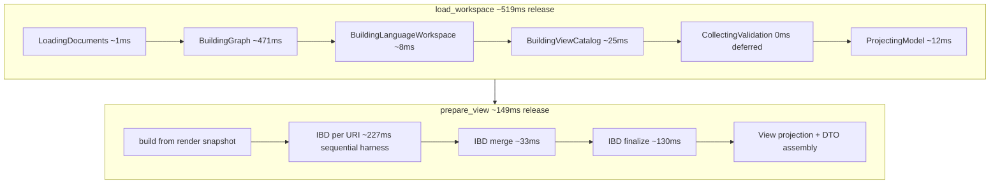

# Robot Vacuum Performance Analysis

Analysis of loading the [sysml-robot-vacuum-cleaner](https://github.com/elan8/sysml-robot-vacuum-cleaner) showcase model through the **`workspace` embedding path** and rendering the first meaningful view (`productStructure` via `general-view`). Measurements from June 2026 profiling on Linux (Ubuntu, `perf_event_paranoid=4`).

## Scenario

| Item | Value |
| --- | --- |
| Fixture | `third_party/sysml-robot-vacuum-cleaner/model` (v0.1.0, see `config/robot-vacuum-cleaner.json`) |
| Files | 21 SysML files, ~109 KB total |
| Primary API | `Spec42Engine::load_workspace` → `HostWorkspaceSnapshot::prepare_view("general-view", Some("productStructure"))` |
| Graph size (workspace DTO) | 1,681 nodes, 2,446 edges |
| Evaluated views | 3 (`ModelViews::*`) |

## Executive summary

Slowness is **not** caused by workspace size. For a 21-file model, the **release** embedding path originally spent **~8.6 s** from cold `load_workspace` through first `prepare_view` (June 2026 baseline).

Progressive optimizations brought the cold path to **~2.8 s** (embedding path), **~2.2 s** (IBD merge/finalize), and **~0.67 s** (graph pipeline + `build_ibd_for_uri` + graph query indexes, June 2026) — roughly **~13× faster** than baseline.

On the current path, **`load_workspace` (~0.5 s)** and **`prepare_view` (~0.15 s)** are both sub-second; **`building_graph` (~0.47 s)** is the largest load phase. Remaining headroom is mostly **repeat `prepare_view`**, **eager validation**, and **IDE/LSP overhead**.

Embedded stdlib/domain libraries add **negligible** marginal cost on warm cache compared to `no_stdlib` for this fixture; engine `build()` was &lt;1 ms after the first materialization.

## Measurements

### Release embedding host (profiling profile, single run)

| Metric | ms | Notes |
| --- | ---: | --- |
| **`load_workspace` total** | **3,623** | Full snapshot build |
| **`prepare_view(productStructure)`** | **4,994** | First view (cold) |
| **Cold path total** | **8,617** | load + prepare |
| `collecting_validation` | 1,840 | ~51% of load |
| `building_graph` | 847 | First graph build |
| `building_language_workspace` | 880 | Second graph build via `InMemoryWorkspace` |
| `building_view_catalog` | 33 | `build_render_snapshot` (deferred IBD mode) |
| `projecting_model` | 20 | Semantic projection |
| `loading_documents` | 1 | Filesystem provider |

Raw JSON: `target/spec42-perf/robot-vacuum-host-phases.json`

### Current release (view-first, deferred validation, single run)

| Metric | ms | Notes |
| --- | ---: | --- |
| **`load_workspace` total** | **519** | Graph reuse; validation deferred |
| **`prepare_view(productStructure)`** | **149** | After graph + IBD build optimizations |
| **Cold path total** | **668** | load + prepare |
| `building_graph` | 471 | Single graph build (was ~881 ms) |
| `building_language_workspace` | 8 | Reuses snapshot graph |
| `building_view_catalog` | 25 | `build_render_snapshot` (deferred IBD) |
| `collecting_validation` | 0 | Deferred on this harness |
| `ibd_merge` / `ibd_finalize` | 33 / 130 | Post-snapshot instrumentation |
| `ibd_per_uri` | 227 | Sequential harness (production parallelizes) |
| Cold one-shot visualization | 338 | No snapshot reuse |

Re-run matrix after latest changes: `robot_vacuum_host_performance_matrix_report` (existing matrix JSON is from pre-optimization runs).

### Release matrix (median of 3 runs)

| Scenario | load ms | prepare ms | total ms |
| --- | ---: | ---: | ---: |
| `no_stdlib` load only | 3,777 | 0 | 3,777 |
| `no_stdlib` load + prepare | 3,760 | 5,122 | 8,882 |
| embedded libs load + prepare | 3,745 | 5,233 | 8,978 |

Raw JSON: `target/spec42-perf/robot-vacuum-host-matrix.json`

### Debug vs release

| Build | load ms | prepare ms | total ms |
| --- | ---: | ---: | ---: |
| **release** (profiling profile) | 3,623 | 4,994 | 8,617 |
| **debug** (test profile) | 29,844 | 20,044 | ~49,888 |

Debug is **~5.8×** slower for the same host path. Any manual testing or IDE integration against a debug `spec42` binary will feel dramatically worse than release.

### Visualization phase breakdown (post-snapshot instrumentation)

Isolated timings on the built snapshot graph (not additive to user path). The harness builds per-URI IBD **sequentially**; production uses `std::thread::scope` in `build_merged_workspace_ibd`, so wall-clock IBD is lower than `ibd_per_uri_ms`.

| Phase | Baseline ms | After embedding | After IBD merge/finalize | After graph + IBD build | Notes |
| --- | ---: | ---: | ---: | ---: | --- |
| `prepare_view` (productStructure) | 5,512 | ~1,860 | ~1,215 | **~147** | Full visualization path |
| `ibd_per_uri` | 2,317 | ~2,317 | ~1,929 | **~227** | `build_ibd_for_uri` × 21 (sequential harness) |
| `ibd_merge` | — | — | ~104 | **~33** | `merge_ibd_payloads_for_workspace_finalize` |
| `ibd_finalize` | — | — | ~867 | **~130** | `finalize_merged_ibd_connectors` |
| `ibd_merge_finalize` (legacy) | 3,406 | ~3,406 | — | — | Replaced by `ibd_merge` + `ibd_finalize` |
| `build_render_snapshot` | 30 | ~32 | ~32 | **~20** | Deferred IBD during load |
| `workspace_graph_dto` | 23 | ~23 | ~23 | **~13** | Graph projection |
| Cold one-shot visualization | 5,024 | ~2,800 | ~2,197 | **~338** | No snapshot reuse |

## Architecture: where time goes



**Key observations (current optimized path):**

- `build_render_snapshot` during load uses **deferred IBD** (~25 ms); `prepare_view` materializes scoped IBD from the render snapshot.
- `InMemoryWorkspace` reuses the snapshot graph (`from_graph_and_documents`) — no duplicate graph build.
- Validation is deferred (`ValidationTiming::Deferred`) on the view-first perf harness; eager validation remains the default for hosts that need diagnostics at load.
- Graph pipeline: single parse per workspace doc, single `link_workspace_relationships`, warm import cache across merges, cached `index_to_node_id` for typing/edge traversal.
- IBD: workspace mapping once at finalize; per-URI typed-shape memoization; consolidated remap/expand; port index for endpoint expansion.

## Flamegraph / CPU profiling

Captured with `kernel.perf_event_paranoid=1` (June 2026):

```bash
cargo flamegraph --profile profiling -p workspace --example profile_robot_vacuum \
  --output target/spec42-perf/robot-vacuum-host.flamegraph.svg -- --embedded-libs
```

**Artifacts:** `target/spec42-perf/robot-vacuum-host.flamegraph.svg` (open in browser), `target/spec42-perf/robot-vacuum-host-top-functions.txt`

| Metric | Value |
| --- | ---: |
| Samples | 41,770 |
| Wall time under `perf record` | ~80 s |
| `libc.so.6` share | 58.8% |
| `profile_robot_vacuum` share | 40.5% |

Profiling adds roughly **1.5–2×** overhead versus uninstrumented runs (same-run phase JSON: load 9,110 ms, prepare 6,582 ms vs ~8,617 ms uninstrumented total).

### Flamegraph findings

Release + LTO inlines many `semantic_core` frames, so the SVG is dominated by allocator and hash-map traffic rather than readable function names. That itself is informative: the pipeline is **allocation-heavy**.

| Observation | Implication |
| --- | --- |
| **58% libc** (`malloc`, `memmove`, `memcmp`, `free`) | Large intermediate structures (IBD payloads, graph maps, diagnostic strings) |
| **hashbrown / SipHash** (~3% each) | Graph indexes and relationship maps |
| **`type_ref_candidates`** (~2.5% in flamegraph) | Validation / type-resolution passes |
| **`import_resolution::resolve_type_reference`** (~0.7%) | Cross-document linking during validation/graph |
| **nom / parser frames** (~0.7–3%) | Parser on duplicate graph-build paths |
| **`expand_relative_endpoint_to_part_path`** (IBD extract) | IBD construction in prepare_view path |

These align with phase timers: **IBD + validation + duplicate graph build**, not raw SysML file I/O.

### Phase timer ↔ CPU alignment

| Phase timer (release, current path) | Flamegraph / perf evidence |
| --- | --- |
| `prepare_view` ~0.15 s; IBD per-URI ~0.23 s (harness) | Allocator-heavy; IBD extract still visible but much reduced |
| `building_graph` ~0.47 s | Parser + merge; duplicate parse/link removed |
| `collecting_validation` 0 ms (deferred harness) | `type_ref_candidates`, import resolution when eager |
| `loading_documents` ~1 ms | Not CPU-bound — confirms size is not the issue |

**Note:** Delete `perf.data` (~2.5 GB) in the repo root after analysis if disk space matters.

## Comparison to expectations

| Expectation | Reality |
| --- | --- |
| "21 files should be fast" | Cold host path is now **~0.67 s** release; graph DTO still has **1,681 nodes** |
| "Snapshot avoids rebuild" | Load defers IBD; first `prepare_view` is **~0.15 s** (scoped IBD + render snapshot) |
| "Phase 5 incremental helps editor saves" | Cold open is fast; edits benefit from `update_snapshot` (experimental) |
| Spike note (~102 s dev) | Consistent with **debug build** + full validation + view (~50 s measured) + harness overhead |

## Ranked improvement opportunities

| Priority | Opportunity | Status | Expected impact |
| --- | --- | --- | --- |
| 1 | Reuse snapshot graph in `InMemoryWorkspace` | **Done** | ~0.9 s release load |
| 2 | Serve `prepare_view` from `WorkspaceRenderSnapshot` | **Done** | Major first-view reduction |
| 3 | Scope IBD to view-exposed packages for `general-view` | **Done** | Reduced IBD source set |
| 4 | Defer validation for view-first hosts | **Done** | ~1.8 s release load (deferred) |
| 5 | IBD internals: merge/finalize/mapping | **Done** | merge+finalize ~3.4 s → ~0.16 s (harness) |
| 6 | Graph pipeline: single parse, single link, query indexes | **Done** | `building_graph` ~881 ms → ~471 ms |
| 7 | `build_ibd_for_uri`: memo, remap/expand, port index | **Done** | per-URI ~1.9 s → ~0.23 s (harness) |
| 8 | Cache `prepared_view` on snapshot | Open | Avoid repeat `prepare_view` cost |
| 9 | Parallel per-document parse/materialize | Open | Multi-core graph build |
| 10 | Release-only server binary for IDE | Open | ~5× vs debug |
| 11 | Phase 5 `update_snapshot` for edits | Open | Saves reload; cold open unchanged |

## After optimizations (June 2026)

Cumulative progression (release, single run, view-first harness):

| Stage | Cold total | `load` | `prepare_view` |
| --- | ---: | ---: | ---: |
| Baseline | ~8,617 ms | ~3,623 ms | ~4,994 ms |
| Embedding path | ~2,809 ms | ~960 ms | ~1,860 ms |
| IBD merge/finalize | ~2,160 ms | ~960 ms | ~1,200 ms |
| **Graph + IBD build** | **~668 ms** | **~519 ms** | **~149 ms** |

### Embedding path (graph reuse, deferred validation, render snapshot, scoped IBD)

Implemented in `workspace`, `semantic_core`, and `kernel` (view-first embedding path with `ValidationTiming::Deferred`):

| Metric | Before (release) | After embedding opts | Change |
| --- | ---: | ---: | --- |
| `load_workspace` | ~3,623–3,777 ms | **~960 ms** | ~−74% |
| `prepare_view(productStructure)` | ~4,994–5,233 ms | **~1,860 ms** | ~−63% |
| **Cold total** | **~8,617–8,978 ms** | **~2,809 ms** | **~−67%** |

### IBD internals (merge, finalize, per-URI enrich)

Implemented in `semantic_core` (`ibd/merge.rs`, `ibd/connectors.rs`, `ibd/extract_impl.rs`, `visualization/response.rs`):

| Change | Effect |
| --- | --- |
| `merge_ibd_payloads_for_workspace_finalize` — skip connector enrich before finalize | Eliminates duplicate `enrich_connector_endpoint_refs` in merge path |
| `build_workspace_instance_def_mappings` — parts indexed by URI; single `extend_instance_def_mappings_with_specializations` | Cuts O(uris × parts) finalize work and repeated mapping clones |
| `merge_member_part_ids` — incremental set merge for container groups | Less allocation in `merge_ibd_payloads` |
| Per-URI: one `enrich_connector_endpoint_refs` after prune (not two) | Less work in `build_ibd_for_uri` |
| Perf harness: `ibd_merge_ms` + `ibd_finalize_ms` split | Regression tracking per phase |

| Metric | After embedding opts | After IBD internals | After graph + IBD build | Change (vs IBD internals) |
| --- | ---: | ---: | ---: | --- |
| `load_workspace` | ~960 ms | ~960 ms | **~519 ms** | **~−46%** |
| `prepare_view(productStructure)` | ~1,860 ms | ~1,200 ms | **~149 ms** | **~−88%** |
| `building_graph` | ~881 ms | ~881 ms | **~471 ms** | **~−46%** |
| `ibd_merge` + `ibd_finalize` (harness) | ~3,406 ms | ~971 ms | **~163 ms** | **~−83%** |
| `ibd_per_uri` (harness, sequential) | ~2,317 ms | ~1,929 ms | **~227 ms** | **~−88%** |
| **Cold total** | **~2,809 ms** | **~2,160 ms** | **~668 ms** | **~−69%** |

### Graph pipeline + query indexes (June 2026)

Implemented in `semantic_core` (`pipeline.rs`, `library_loader.rs`, `graph.rs`, `graph_builder/mod.rs`):

| Change | Effect |
| --- | --- |
| Remove duplicate `link_workspace_relationships` before `finalize_workspace_graph` | One link pass instead of two |
| `declared_packages_from_parsed` — no second parse for package discovery | 21 fewer full parses on robot-vacuum |
| `index_to_node_id` cache (`Arc`) for edge/typing traversal | Avoids rebuilding reverse map per `outgoing_typing` call |
| Skip per-merge `import_lookup_cache` clear | Warm cache during pending resolve |
| `invalidate_query_indexes` on node insert | Safe cache during incremental graph build |

### `build_ibd_for_uri` optimizations (June 2026)

Implemented in `semantic_core` (`ibd/extract_impl.rs`, `ibd/connectors.rs`):

| Change | Effect |
| --- | --- |
| Memo `part_def_has_materialized_shape` / `first_typed_part_shape` | Fewer specialization tree walks |
| `typed_roots` — single pass for expand + mirror | No duplicate typed-shape lookup |
| Connector path: one remap + one expand (was three remaps + two expands) | Less O(connectors × mappings) work |
| Port-name index for `expand_relative_endpoint` | O(1) port lookup per part |
| `extend_instance_def_mappings` without full `mappings.clone()` | Less finalize allocation |
| Reuse cached `nodes` for `def_container_prefixes` | No second `nodes_for_uri` |

Regression ceilings (release, view-first harness): load ≤ 3,000 ms, prepare ≤ 2,500 ms, total ≤ 5,500 ms — see `workspace::robot_vacuum_perf::release_perf_thresholds()`.

**Remaining headroom:** `prepared_view` snapshot cache (repeat views), parallel per-document materialize (multi-core load), parse-once cache in filesystem provider (embedded-lib hosts), release IDE binary, incremental `update_snapshot` for edits.

## Validation / diagnostics scenarios (June 2026)

After workspace-level validation optimizations (shared `UnitRegistry` per report, document text index):

| Scenario | Metric | Release (single run) | Notes |
| --- | --- | ---: | --- |
| `validation_eager_at_load` | `time_to_completed_validation_ms` | **~2,707** | Validation during `load_workspace` |
| `validation_deferred_ensure` | `time_to_completed_validation_ms` | **~2,783** (stale; re-measure after graph opts) | `load` (~520 ms) + `ensure_validation()` |
| `view_then_validation` | `time_to_completed_validation_ms` | **~4,681** | View first, then diagnostics |

Regression ceilings: `release_validation_perf_thresholds()` in `robot_vacuum_perf.rs` (eager ≤ 3.5 s, deferred ensure ≤ 3.0 s, view-then-validation ≤ 5.5 s).

```bash
cargo test -p workspace --test robot_vacuum_performance \
  robot_vacuum_host_validation_performance_report --release -- --ignored --nocapture
```

## How to reproduce

```bash
# Fixture
bash scripts/fetch-robot-vacuum-cleaner.sh

export CARGO_TARGET_DIR=/home/jeroen/git/spec42/target
export TMPDIR=/home/jeroen/git/spec42/target/tmp

# Single release report
cargo test -p workspace --test robot_vacuum_performance \
  robot_vacuum_host_phase_performance_report --release -- --ignored --nocapture

# Full matrix (3× per scenario, ~5 min release)
cargo test -p workspace --test robot_vacuum_performance \
  robot_vacuum_host_performance_matrix_report --release -- --ignored --nocapture

# Profiling example (writes target/spec42-perf/robot-vacuum-host-phases.json)
cargo build -p workspace --profile profiling --example profile_robot_vacuum
target/profiling/examples/profile_robot_vacuum --embedded-libs
target/profiling/examples/profile_robot_vacuum --matrix
```

Override fixture path: `SYSML_ROBOT_VACUUM_DIR=/path/to/checkout`

## Appendix

### Artifacts

| File | Contents |
| --- | --- |
| `target/spec42-perf/robot-vacuum-host-phases.json` | Single-run host + visualization phases (`ibd_merge_ms`, `ibd_finalize_ms`) |
| `target/spec42-perf/robot-vacuum-host-matrix.json` | Median matrix (re-run after IBD internals; may show legacy fields until refreshed) |
| `target/spec42-perf/robot-vacuum-host-top-functions.txt` | Phase-ranked + perf report summary |
| `target/spec42-perf/robot-vacuum-host.flamegraph.svg` | CPU flamegraph (requires `perf_event_paranoid <= 1`) |

### LSP / VS Code (not profiled in depth)

Opening the same model in VS Code adds LSP startup indexing, `sysml/model` Model Explorer payload, JSON transfer, and webview ELK. See [POWER-SYSTEMS-PERFORMANCE-ANALYSIS.md](./POWER-SYSTEMS-PERFORMANCE-ANALYSIS.md) for multipliers (~3–5× debug server, duplicate visualization paths). Expect robot-vacuum IDE cold open to exceed the **~0.67 s** host-only release baseline.

### Harness code

- [`crates/workspace/src/robot_vacuum_perf.rs`](../crates/workspace/src/robot_vacuum_perf.rs)
- [`crates/workspace/examples/profile_robot_vacuum.rs`](../crates/workspace/examples/profile_robot_vacuum.rs)
- [`crates/workspace/tests/robot_vacuum_performance.rs`](../crates/workspace/tests/robot_vacuum_performance.rs)
