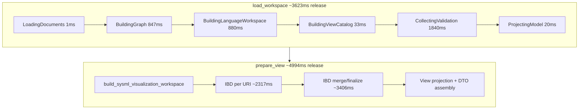

# Robot Vacuum Performance Analysis

Analysis of loading the [sysml-robot-vacuum-cleaner](https://github.com/elan8/sysml-robot-vacuum-cleaner) showcase model through the **`spec42_host` embedding path** and rendering the first meaningful view (`productStructure` via `general-view`). Measurements from June 2026 profiling on Linux (Ubuntu, `perf_event_paranoid=4`).

## Scenario

| Item | Value |
| --- | --- |
| Fixture | `third_party/sysml-robot-vacuum-cleaner/model` (v0.1.0, see `config/robot-vacuum-cleaner.json`) |
| Files | 21 SysML files, ~109 KB total |
| Primary API | `Spec42Engine::load_workspace` → `HostWorkspaceSnapshot::prepare_view("general-view", Some("productStructure"))` |
| Graph size (workspace DTO) | 1,681 nodes, 2,446 edges |
| Evaluated views | 3 (`ModelViews::*`) |

## Executive summary

Slowness is **not** caused by workspace size. For a 21-file model, the **release** embedding path still spends **~8.6 s** from cold `load_workspace` through first `prepare_view`, and **~50 s** in a **debug** build.

Roughly **80% of user-visible time** splits as:

1. **`prepare_view` (~5 s release)** — rebuilds visualization artifacts; **IBD per-URI build + merge/finalize** dominate (~5.7 s in isolated instrumentation).
2. **`collect_host_validation_report` (~1.8 s release)** — largest single phase inside `load_workspace` (~51% of snapshot build).
3. **Duplicate semantic graph construction (~1.7 s release)** — `build_semantic_graph_from_documents` runs twice: once in snapshot build, again in `InMemoryWorkspace::from_documents`.

Embedded stdlib/domain libraries add **negligible** marginal cost on warm cache compared to `no_stdlib` for this fixture; engine `build()` was &lt;1 ms after the first materialization.

## Measurements

### Release embedding host (profiling profile, single run)

| Metric | ms | Notes |
| --- | ---: | --- |
| **`load_workspace` total** | **3,623** | Full snapshot build |
| **`prepare_view(productStructure)`** | **4,994** | First view (cold) |
| **Cold path total** | **8,617** | load + prepare |
| `collecting_validation` | 1,840 | ~51% of load |
| `building_graph` | 847 | First graph build |
| `building_language_workspace` | 880 | Second graph build via `InMemoryWorkspace` |
| `building_view_catalog` | 33 | `build_render_snapshot` (deferred IBD mode) |
| `projecting_model` | 20 | Semantic projection |
| `loading_documents` | 1 | Filesystem provider |

Raw JSON: `target/spec42-perf/robot-vacuum-host-phases.json`

### Release matrix (median of 3 runs)

| Scenario | load ms | prepare ms | total ms |
| --- | ---: | ---: | ---: |
| `no_stdlib` load only | 3,777 | 0 | 3,777 |
| `no_stdlib` load + prepare | 3,760 | 5,122 | 8,882 |
| embedded libs load + prepare | 3,745 | 5,233 | 8,978 |

Raw JSON: `target/spec42-perf/robot-vacuum-host-matrix.json`

### Debug vs release

| Build | load ms | prepare ms | total ms |
| --- | ---: | ---: | ---: |
| **release** (profiling profile) | 3,623 | 4,994 | 8,617 |
| **debug** (test profile) | 29,844 | 20,044 | ~49,888 |

Debug is **~5.8×** slower for the same host path. Any manual testing or IDE integration against a debug `spec42` binary will feel dramatically worse than release.

### Visualization phase breakdown (post-snapshot instrumentation)

Isolated timings on the built snapshot graph (not additive to user path):

| Phase | ms | Notes |
| --- | ---: | --- |
| `prepare_view` (productStructure) | 5,512 | Full `build_sysml_visualization_workspace` |
| `ibd_merge_finalize` | 3,406 | `merge_ibd_payloads` + `finalize_merged_ibd_connectors` |
| `ibd_per_uri` | 2,317 | `build_ibd_for_uri` × 21 files |
| `build_render_snapshot` | 30 | Deferred IBD during load |
| `workspace_graph_dto` | 23 | Graph projection |
| Cold one-shot visualization | 5,024 | `build_semantic_graph_with_provider` + full viz (no snapshot reuse) |

## Architecture: where time goes



**Key observations:**

- `build_render_snapshot` during load uses **deferred IBD** (~33 ms) but `prepare_view` pays the full IBD cost later.
- `InMemoryWorkspace::from_documents` repeats `build_semantic_graph_from_documents` instead of reusing the snapshot graph.
- Validation runs over the full workspace + library context even when the host only needs a view payload.

## Flamegraph / CPU profiling

Captured with `kernel.perf_event_paranoid=1` (June 2026):

```bash
cargo flamegraph --profile profiling -p spec42_host --example profile_robot_vacuum \
  --output target/spec42-perf/robot-vacuum-host.flamegraph.svg -- --embedded-libs
```

**Artifacts:** `target/spec42-perf/robot-vacuum-host.flamegraph.svg` (open in browser), `target/spec42-perf/robot-vacuum-host-top-functions.txt`

| Metric | Value |
| --- | ---: |
| Samples | 41,770 |
| Wall time under `perf record` | ~80 s |
| `libc.so.6` share | 58.8% |
| `profile_robot_vacuum` share | 40.5% |

Profiling adds roughly **1.5–2×** overhead versus uninstrumented runs (same-run phase JSON: load 9,110 ms, prepare 6,582 ms vs ~8,617 ms uninstrumented total).

### Flamegraph findings

Release + LTO inlines many `semantic_core` frames, so the SVG is dominated by allocator and hash-map traffic rather than readable function names. That itself is informative: the pipeline is **allocation-heavy**.

| Observation | Implication |
| --- | --- |
| **58% libc** (`malloc`, `memmove`, `memcmp`, `free`) | Large intermediate structures (IBD payloads, graph maps, diagnostic strings) |
| **hashbrown / SipHash** (~3% each) | Graph indexes and relationship maps |
| **`type_ref_candidates`** (~2.5% in flamegraph) | Validation / type-resolution passes |
| **`import_resolution::resolve_type_reference`** (~0.7%) | Cross-document linking during validation/graph |
| **nom / parser frames** (~0.7–3%) | Parser on duplicate graph-build paths |
| **`expand_relative_endpoint_to_part_path`** (IBD extract) | IBD construction in prepare_view path |

These align with phase timers: **IBD + validation + duplicate graph build**, not raw SysML file I/O.

### Phase timer ↔ CPU alignment

| Phase timer (release, uninstrumented) | Flamegraph / perf evidence |
| --- | --- |
| `prepare_view` ~5 s; IBD merge ~3.4 s | Allocator-heavy; IBD extract frames present |
| `collecting_validation` ~1.8 s | `type_ref_candidates`, import resolution |
| Duplicate graph ~1.7 s | Parser frames appear multiple times in profile |
| `loading_documents` ~1 ms | Not CPU-bound — confirms size is not the issue |

**Note:** Delete `perf.data` (~2.5 GB) in the repo root after analysis if disk space matters.

## Comparison to expectations

| Expectation | Reality |
| --- | --- |
| "21 files should be fast" | Graph DTO has **1,681 nodes**; view pipeline builds **full-workspace IBD** for all 21 URIs on every `prepare_view` |
| "Snapshot avoids rebuild" | Load defers IBD; first view pays full visualization cost |
| "Phase 5 incremental helps editor saves" | Cold open still pays full `load_workspace` + first `prepare_view` |
| Spike note (~102 s dev) | Consistent with **debug build** + full validation + view (~50 s measured) + harness/instrumentation overhead |

## Ranked improvement opportunities (facts only — not implemented here)

| Priority | Opportunity | Expected impact | Risk |
| --- | --- | --- | --- |
| 1 | Reuse snapshot graph in `InMemoryWorkspace` (accept pre-built graph + parsed docs) | ~0.9 s release (~25% of load) | API change in `language_service` |
| 2 | Serve `prepare_view` from `WorkspaceRenderSnapshot` / materialized bundles instead of cold `build_sysml_visualization_workspace` | ~5 s release (first view) | Cache invalidation contract |
| 3 | Scope IBD to view-exposed packages (interconnection-style) for `general-view` | Large reduction in IBD merge | Correctness parity tests required |
| 4 | Defer or scope `collect_host_validation_report` for interactive view-first hosts | ~1.8 s release | Hosts needing immediate full validation |
| 5 | Release-only server binary for IDE integration | ~5× vs debug | Packaging / F5 workflow |
| 6 | Phase 5 `update_snapshot` for edits (not cold open) | Saves reload; first open unchanged | Experimental gate |

## After optimizations (June 2026)

Implemented in `spec42_host`, `semantic_core`, and `kernel` (view-first embedding path with `ValidationTiming::Deferred`):

| Metric | Before (release) | After (release, single run) | Change |
| --- | ---: | ---: | --- |
| `load_workspace` | ~3,623–3,777 ms | **949 ms** | ~−74% (graph reuse + deferred validation) |
| `prepare_view(productStructure)` | ~4,994–5,233 ms | **1,860 ms** | ~−63% (render snapshot reuse + scoped IBD) |
| **Cold total** | **~8,617–8,978 ms** | **2,809 ms** | **~−67%** |

Regression ceilings (release, view-first harness): load ≤ 3,000 ms, prepare ≤ 2,500 ms, total ≤ 5,500 ms — see `spec42_host::robot_vacuum_perf::release_perf_thresholds()`.

**Remaining headroom:** further `prepare_view` gains require IBD merge/allocation reductions; eager validation remains available via `ValidationTiming::Eager` (default) for hosts that need diagnostics at load time.

## Validation / diagnostics scenarios (June 2026)

After workspace-level validation optimizations (shared `UnitRegistry` per report, document text index):

| Scenario | Metric | Release (single run) | Notes |
| --- | --- | ---: | --- |
| `validation_eager_at_load` | `time_to_completed_validation_ms` | **~2,707** | Validation during `load_workspace` |
| `validation_deferred_ensure` | `time_to_completed_validation_ms` | **~2,783** | `load` (~950 ms) + `ensure_validation()` (~1,845 ms) |
| `view_then_validation` | `time_to_completed_validation_ms` | **~4,681** | View first, then diagnostics |

Regression ceilings: `release_validation_perf_thresholds()` in `robot_vacuum_perf.rs` (eager ≤ 3.5 s, deferred ensure ≤ 3.0 s, view-then-validation ≤ 5.5 s).

```bash
cargo test -p spec42_host --test robot_vacuum_performance \
  robot_vacuum_host_validation_performance_report --release -- --ignored --nocapture
```

## How to reproduce

```bash
# Fixture
bash scripts/fetch-robot-vacuum-cleaner.sh

export CARGO_TARGET_DIR=/home/jeroen/git/spec42/target
export TMPDIR=/home/jeroen/git/spec42/target/tmp

# Single release report
cargo test -p spec42_host --test robot_vacuum_performance \
  robot_vacuum_host_phase_performance_report --release -- --ignored --nocapture

# Full matrix (3× per scenario, ~5 min release)
cargo test -p spec42_host --test robot_vacuum_performance \
  robot_vacuum_host_performance_matrix_report --release -- --ignored --nocapture

# Profiling example (writes target/spec42-perf/robot-vacuum-host-phases.json)
cargo build -p spec42_host --profile profiling --example profile_robot_vacuum
target/profiling/examples/profile_robot_vacuum --embedded-libs
target/profiling/examples/profile_robot_vacuum --matrix
```

Override fixture path: `SYSML_ROBOT_VACUUM_DIR=/path/to/checkout`

## Appendix

### Artifacts

| File | Contents |
| --- | --- |
| `target/spec42-perf/robot-vacuum-host-phases.json` | Single-run host + visualization phases |
| `target/spec42-perf/robot-vacuum-host-matrix.json` | Median matrix (3 scenarios × 3 runs) |
| `target/spec42-perf/robot-vacuum-host-top-functions.txt` | Phase-ranked + perf report summary |
| `target/spec42-perf/robot-vacuum-host.flamegraph.svg` | CPU flamegraph (requires `perf_event_paranoid <= 1`) |

### LSP / VS Code (not profiled in depth)

Opening the same model in VS Code adds LSP startup indexing, `sysml/model` Model Explorer payload, JSON transfer, and webview ELK. See [POWER-SYSTEMS-PERFORMANCE-ANALYSIS.md](./POWER-SYSTEMS-PERFORMANCE-ANALYSIS.md) for multipliers (~3–5× debug server, duplicate visualization paths). Expect robot-vacuum IDE cold open to exceed the **~8.6 s** host-only release baseline.

### Harness code

- [`crates/spec42_host/src/robot_vacuum_perf.rs`](../crates/spec42_host/src/robot_vacuum_perf.rs)
- [`crates/spec42_host/examples/profile_robot_vacuum.rs`](../crates/spec42_host/examples/profile_robot_vacuum.rs)
- [`crates/spec42_host/tests/robot_vacuum_performance.rs`](../crates/spec42_host/tests/robot_vacuum_performance.rs)
