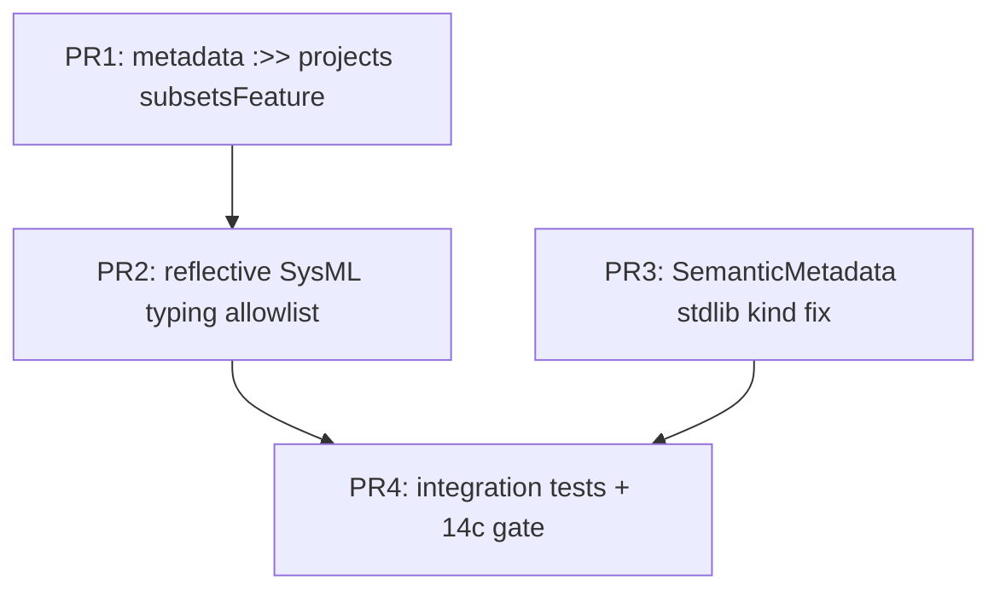

# Spec42 — Standard library resolution guide

Date: 2026-06-12

This guide describes how Spec42 loads and resolves the OMG **SysML v2 standard library** (`sysml.library`), which gaps remain, and how to fix them. It is written for Spec42 contributors; consumer projects track outcomes in [`SPEC42_FIXES_NEEDED.md`](../../../sysml-robot-vacuum-cleaner/docs/SPEC42_FIXES_NEEDED.md).

Related docs:

- [`resolution-contract.md`](../../crates/semantic_core/docs/resolution-contract.md) — pipeline and resolver roles
- [`DIAGNOSTIC-CHECKS-ROADMAP.md`](DIAGNOSTIC-CHECKS-ROADMAP.md) — diagnostic inventory

---

## 1. Architecture

### 1.1 Bundled stdlib

Spec42 ships the official `sysml.library` tree (pinned version, currently **`2026-04`**):

- Embedded at build time (`crates/server/src/stdlib.rs`)
- Materialized under `%LOCALAPPDATA%\Elan8\spec42\data\standard-library\versions\2026-04\sysml.library`
- Verified with `spec42 doctor` → `standard_library_status`

The CLI and LSP always prepend this path unless overridden.

### 1.2 Import- and typing-scoped loading

Library files are **not** merged into the graph by default. They enter through workspace **import closure** plus optional **typing/specialization closure**:

```
workspace sources
  → collect import targets and type/specialization references
  → transitive closure (library_loader.rs)
  → parse + merge library documents
  → link + diagnostics
```

`resolve_library_closure` seeds packages from:

- explicit `import` statements (transitive),
- part/port/attribute type references and `:>` specializations in workspace text (`bootstrap_typing_references`, default on),
- `SysML::` qualified names and unit literals (existing bootstrap rules).

Disable typing seeds with `LibraryClosureOptions { bootstrap_typing_references: false, .. }`. Full library tree scans remain available via `SPEC42_LIBRARY_FULL_SCAN` (dev override only).

Key file: `crates/semantic_core/src/semantic/library_loader.rs`

### 1.3 SysML namespace bootstrap

When workspace text contains `SysML::` qualified names, or imports `sysml` / `sysml::*`, the loader seeds the **`SysML` package** and optionally the full stdlib slice:

```rust
// library_loader.rs (conceptual)
if content.contains("SysML::") {
    seeds.insert("SysML");
}
if wants_sysml_bootstrap {
    // load packages under sysml.library roots
}
```

This is documented in `resolution-contract.md` § SysML library bootstrap.

### 1.4 Semantic pipeline

```
build_graph_from_doc
  → merge workspace + libraries
  → link_workspace_relationships
  → resolve_workspace_pending_relationships
  → collect_diagnostics_from_graph
```

Entry: `semantic/pipeline.rs` → `build_and_link_graph`.

---

## 2. Status overview

| ID | Problem | Diagnostic | Showcase impact | Status |
| --- | --- | --- | --- | --- |
| STD-001 | `SysML` namespace not resolvable | `invalid_qualified_name_segment` | Domain `RequirementMetadata`, ISQ imports | **Fixed** |
| STD-002 | `#derivation connection` flagged as structural connect | `connection_context_invalid` | Traceability examples | **Fixed** |
| STD-003 | `satisfy req by part` rejected | `satisfy_invalid_endpoint_kind` | Architecture satisfaction | **Fixed** |
| STD-004 | Metadata `:>> annotatedElement : SysML::…` typed as normal attribute | `incompatible_type_kind` | OMG `14c-Language Extensions` | **Fixed** |
| STD-005 | Imported `SemanticMetadata` resolves as `kermlDecl` | `incompatible_specializes_kind` | OMG `14c`, some profiles | **Fixed** |
| STD-006 | `standard library package` not treated as namespace | `invalid_qualified_name_segment` (segment not a namespace) | Rare QN walks | **Fixed** (with STD-001) |
| STD-007 | Reflective stdlib types not in typing allowlist | `incompatible_type_kind` | Metadata restrictions | **Fixed** (with STD-004) |

**Showcase corpora (2026-06-12):**

| Corpus | Warnings |
| --- | ---: |
| `sysml-domain-libraries` (local, 61 docs) | 0 |
| `sysml-robot-vacuum-cleaner/model` (13 docs) | 0 |
| OMG `14c-Language Extensions.sysml` | 26 |

---

## 3. Fixed issues (reference for regressions)

### STD-001 — `SysML::` qualified names

**Symptom (before):**

```
invalid_qualified_name_segment: segment 'SysML' does not resolve
```

**Canonical model syntax:**

```sysml
:> annotatedElement : SysML::RequirementUsage;
:>> baseType = requirementChecks meta SysML::Usage;
```

**Root cause:** Qualified-name validation (`name_resolution.rs` → `invalid_qualified_name_segment`) required every prefix segment to resolve as a namespace. The bundled `SysML` root was not indexed, or `standard library package` nodes were not classified as namespaces.

**Fix direction:**

1. Bootstrap `SysML` into library closure when `SysML::` appears (`library_loader.rs`).
2. Extend `is_namespace()` in `kinds.rs` if stdlib packages use element kinds not previously listed (e.g. treat top-level library packages as namespaces in QN walks).
3. Ensure `node_ids_for_qualified_name("SysML")` resolves after merge.

**Regression gate:** `tests/resolution_contract.rs` → `contract_sysml_qualified_metadata_restrictions_resolve_without_warnings`, `contract_sibling_import_resolves_sysml_requirement_usage`.

---

### STD-002 — Derivation connections

**Symptom:** `connection_context_invalid` between two `requirement` endpoints.

**Expected:** `#derivation connection` produces a `RelationshipKind::Derivation` edge only; no structural `Connection` edge between requirements (`interface_def.rs` skips connection wiring; `relationships.rs` → `try_wire_derivation_connection`).

**Fix (implemented):** `add_connection_edges_from_end_typing` skips `derivation connection` parents so requirement endpoints are not linked by structural `Connection` edges. No diagnostic bypass in `connection_conformance.rs`.

**Regression gate:** `resolution_contract.rs` → `contract_derivation_connection_has_derivation_edge_not_connection_context_invalid`.

---

### STD-003 — Satisfy by design element

**Symptom:** `satisfy_invalid_endpoint_kind` for `satisfy patrolAisles by rover`.

**Expected:** SysML v2 allows `satisfy <requirement> by <part | action | …>` (training: `Requirement Satisfaction.sysml`).

**Fix direction:** Relax `requirement_case_conformance.rs` — allow satisfier kinds beyond requirement/use-case (e.g. `part`, `part def`, `action def`, channels used as design elements).

**Regression gate:** `resolution_contract.rs` → `contract_satisfy_requirement_by_part_is_valid`.

---

## 4. Recently fixed — metadata restrictions (STD-004 / STD-005 / STD-007)

### STD-004 / STD-007 — Metadata restrictions with `:>>` and `SysML::` types

**Symptom (before, on OMG `14c`):**

```
incompatible_type_kind: 'attribute' cannot type 'annotatedElement' with 'SysML::RequirementUsage';
expected a compatible attribute definition.
```

**Why domain libraries are clean but OMG `14c` is not**

Domain library `RequirementMetadata.sysml` uses **subset** shorthand:

```sysml
:> annotatedElement : SysML::RequirementUsage;
```

OMG `14c` uses **redefine** shorthand:

```sysml
:>> annotatedElement : SysML::RequirementUsage;
:>> baseType = fmeaRequirements meta SysML::Usage;
```

Graph builder behaviour today (`attribute_body.rs`):

| Syntax | Graph attribute | `is_metadata_restriction_attribute` | Kind check skipped? |
| --- | --- | --- | --- |
| `:> annotatedElement : T` | `subsetsFeature = "annotatedElement"` | yes | yes |
| `:>> annotatedElement : T` | `redefines = "annotatedElement"` only | **no** | **no** → warning |

Policy already documented in `resolution-contract.md`:

> Attributes with `subsetsFeature` (metadata restriction shorthand) use reflective KerML/SysML typing targets; normal attribute typing rules do not apply.

**Fix (implemented):**

1. **`attribute_body.rs`** — `:>>` on metadata def restriction features projects `subsetsFeature` alongside `redefines`.
2. **`kinds.rs`** — `is_metadata_restriction_attribute`, `is_reflective_sysml_usage_type`.
3. **`kind_compatibility.rs` / `name_resolution.rs`** — skip normal typing rules for restriction attributes; allow reflective `SysML::` targets.

**Regression gate:** `resolution_contract.rs` → `contract_metadata_redefine_shorthand_annotated_element_no_incompatible_type_kind`, `contract_omg_style_fmea_metadata_block_no_metadata_typing_warnings`; fixture `tests/fixtures/stdlib/omg_14c_metadata_slice.sysml`.

---

### STD-005 — `SemanticMetadata` supertype from standard library

**Symptom (before):**

```
incompatible_specializes_kind: 'SituationMetadata' cannot specialize 'SemanticMetadata' (resolved to 'kermlDecl').
unresolved_redefines_target: Redefines target 'baseType' on 'baseType' could not be resolved.
```

**Expected:** `private import Metaobjects::SemanticMetadata` resolves to a **metadata def** (or compatible supertype), not a bare KerML declaration node.

**Fix (implemented):**

1. **`package_body.rs`** — KerML `SemanticMetadata` materialized as `metadata def` with `metaclassRole`; nested KerML features become `attribute def` children.
2. **`kinds.rs`** — `is_kerml_metadata_supertype` matches `metaclassRole`, qualified name, and `metadata def` / `kermlDecl` kinds.

**Regression gate:** `resolution_contract.rs` → `contract_imported_semantic_metadata_specializes_without_warnings`; `library_loader.rs` → `closure_loads_metaobjects_when_workspace_imports_semantic_metadata`.

---

## 5. Namespace indexing checklist

When adding or changing stdlib resolution, verify:

| Check | Command / test |
| --- | --- |
| Doctor healthy | `spec42 doctor --format json` |
| `SysML::RequirementUsage` resolves | `resolution_contract` tests |
| No QN false positives on domain libs | `spec42 check` on `RequirementMetadata.sysml` |
| ISQ / SI units resolve | robot `AnalysisCases.sysml`, `[EUR]`, `[mAh]` |
| View filters `@SysML::PartUsage` | `p2_diagnostics_semantics.rs`, `explicit_views.rs` tests |
| OMG validation corpus improves | `scripts/check-omg-14c-metadata-ratchet.sh` (nightly) |

### Extend `is_namespace` when needed

Current definition (`kinds.rs`):

```rust
pub fn is_namespace(element_kind: &str) -> bool {
    matches!(element_kind, "package" | "requirement def" | …)
}
```

If stdlib top-level packages are indexed with a different kind (e.g. library-specific marker), add it here **or** normalize library package nodes to `"package"` at graph build time.

---

## 6. Recommended PR sequence



1. **PR1 — Graph projection** (`attribute_body.rs`, optional `kinds.rs`) — fixes STD-004 for `:>> annotatedElement`.
2. **PR2 — Typing policy** (`kind_compatibility.rs`) — allow `SysML::…` reflective targets on restriction attributes that still run checks.
3. **PR3 — Library kind normalization** (graph builder for `.kerml` / `Metaobjects`) — fixes STD-005 cascade on `baseType`.
4. **PR4 — Tests + CI gate** — expand `resolution_contract.rs`; optionally add `spec42 check` on OMG `14c` to CI with a warning budget that ratchets down.

---

## 7. Local development commands

```powershell
# Rebuild Spec42 after semantic_core changes
cd C:\Git\spec42
cargo build -p spec42

# Contract tests (mandatory before merge)
cargo test -p semantic_core resolution_contract
cargo test -p semantic_core --test metadata_semantics
cargo test -p semantic_core --test requirement_derivation_semantics

# Domain + robot corpora
C:\Git\spec42\target\debug\spec42.exe `
  --library-path C:\Git\sysml-domain-libraries\domain `
  --library-path C:\Git\sysml-domain-libraries\technical `
  --library-path C:\Git\sysml-domain-libraries\generic `
  check C:\Git\sysml-domain-libraries --workspace-root C:\Git\sysml-domain-libraries

C:\Git\spec42\target\debug\spec42.exe check C:\Git\sysml-robot-vacuum-cleaner\model

# OMG stress test
C:\Git\spec42\target\debug\spec42.exe check `
  "C:\Git\sysml-v2-release\sysml\src\validation\14-Language Extensions\14c-Language Extensions.sysml"
```

---

## 8. Out of scope (separate tracks)

These appear in OMG `14c` but are **not** stdlib resolution bugs:

| Diagnostic | Cause |
| --- | --- |
| `unsupported_annotation_syntax` | Parser / annotation surface for FMEA worked examples |
| `unresolved_import_target` | Missing `FMEALibrary` / `FMEAMetadata` in validation slice |
| `unresolved_specializes_reference` | `Occurrences::HappensBefore` not in loaded closure |

Track under parser / example-closure work, not stdlib QN resolution.

---

## 9. Tracking IDs (cross-repo)

| Spec42 ID | Consumer doc ID | Summary |
| --- | --- | --- |
| STD-001 | S42-FIX-001 | `SysML::` namespace resolution |
| STD-004/007 | S42-FIX-006 | Metadata `:>> annotatedElement` + reflective typing |
| STD-005 | (part of S42-FIX-002) | `SemanticMetadata` stdlib supertype |
| STD-002 | S42-FIX-003 | Derivation connection diagnostics |
| STD-003 | S42-FIX-004 | Satisfy by design element |

Update both this guide and [`SPEC42_FIXES_NEEDED.md`](../../../sysml-robot-vacuum-cleaner/docs/SPEC42_FIXES_NEEDED.md) when closing items.
