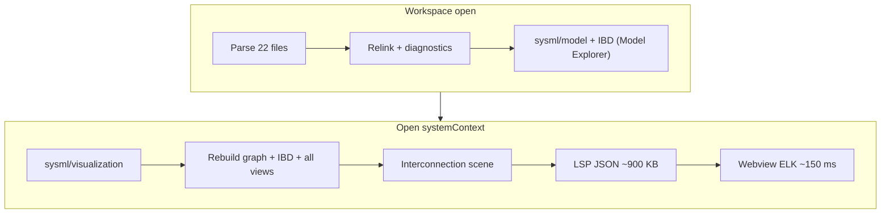

# Stedin / Power Systems Performance Analysis

Analysis of loading the [sysml-powersystems](https://github.com/) workspace and opening the `systemContext` interconnection diagram. Captures measurements from March 2026 profiling on Windows (x86_64).

## Scenario

| Item | Value |
|------|-------|
| Workspace | `C:\Git\sysml-powersystems` (22 SysML files, ~78 KB) |
| Diagram | `systemContext` (`interconnection-view`) |
| Diagram size | 20 parts, 19 connectors, 19 scene edges |
| User path | VS Code: open folder → Model Explorer indexes → open visualizer → select `systemContext` |

## Executive summary

Slowness is **not** caused by ELK layout or SVG rendering (~150 ms). Almost all time is spent in **Rust building visualization DTOs**, especially **IBD construction and merging** (~3 s per visualization build in release; duplicated across Model Explorer and visualizer). VS Code feels slower than CLI because it runs the debug server under F5 (~3–5×), repeats heavy work on startup, and ships large JSON payloads over LSP.

## Measurements

### Release CLI (`spec42 diagrams export`)

| Metric | Value |
|--------|------:|
| Total wall time | ~8.5 s |
| `modelBuildTimeMs` (payload stats) | 8,429 ms |
| Response size (JSON) | ~1.3 MB |
| Graph in payload | 251 nodes, 310 edges |
| Webview ELK layout | ~150 ms |

### Debug vs release binary

| Build | `systemContext` export |
|-------|----------------------:|
| `target/release/spec42.exe` | ~8.5 s |
| `target/debug/spec42.exe` | ~29–47 s |

F5 **Launch Extension** stages `target/debug/spec42.exe` by default.

### Automated drill-down test (debug test profile, cached LSP graph)

Run locally:

```powershell
cargo test -p kernel --test lsp_integration integration::stedin_performance::stedin_system_context_performance_report -- --ignored --nocapture
```

Requires `C:\Git\sysml-powersystems` (override with `STEDIN_REPO` or `SYSML_POWERSYSTEMS_DIR`). Report written to `target/spec42-perf/stedin-system-context-performance.json`.

**Phase breakdown** (in-process, semantic graph already built):

| Phase | ms | Notes |
|-------|---:|-------|
| `ibdPerUri` | 1,705 | `build_ibd_for_uri` × 22 files |
| `ibdMergeFinalize` | 1,485 | merge + `finalize_merged_ibd_connectors` |
| `fullVisualizationWorkspace` | 3,561 | full `build_sysml_visualization_workspace` |
| `evaluateViews` | 111 | 8 explicit views |
| `projectAllViews` | 72 | per-view ID projection |
| `interconnectionScene` | 4 | scene for `systemContext` only |
| `workspaceGraphDto` | 29 | workspace graph projection |
| `semanticGraphBuild` | 733 | cold parse + graph (one-time) |

**LSP path** (mirrors VS Code after indexing):

| Step | ms | Notes |
|------|---:|-------|
| Startup relink | 481 | cross-doc edges, relationships |
| Startup diagnostics | 612 | all workspace files |
| `sysml/model` (Model Explorer) | 1,196 | includes **855 ms IBD**; **3.0 MB** response |
| `sysml/visualization` (`systemContext`) | 3,632 | **3,562 ms** model build; **911 KB** response |

### VS Code overhead (estimated)

| Factor | Impact |
|--------|--------|
| Debug server under F5 | 3–5× on all Rust phases |
| Duplicate IBD build (explorer + visualizer) | ~1–3 s release, ~5–15 s debug |
| Startup indexing before diagram | ~0.5–1 s release relink + diagnostics |
| JSON clone in extension (`toWebviewUpdateMessage`) | minor vs Rust |
| Webview prepare + ELK | &lt;1 s |

**Estimated VS Code total (F5 debug):** ~60–90 s from folder open to rendered `systemContext`.

**Estimated VS Code total (release server):** ~15–25 s.

## Architecture: where time goes



`build_sysml_visualization_workspace` always:

1. Builds the full workspace graph DTO (251 nodes for the selected view projection; 1,086 nodes for workspace model).
2. Builds and merges IBD for **every** workspace URI.
3. Evaluates and projects **all 8** explicit views.
4. Builds activity/sequence/state payloads even when only interconnection is requested.

The LSP caches the **semantic graph** after indexing, but **does not cache** visualization DTOs. Each `sysml/visualization` call recomputes from scratch.

## Bottleneck ranking

1. **IBD build + merge** (~3.2 s of ~3.6 s visualization build) — dominant cost; run twice per VS Code session (explorer + visualizer).
2. **Debug binary in development** — multiplies all Rust work.
3. **O(all views) visualization pipeline** — projects 8 views when only one is shown.
4. **Large LSP payloads** — 3 MB workspace model + 900 KB visualization; JSON serialization on stdio.
5. **Startup diagnostics** — 612 ms for 22 files (acceptable alone, adds to perceived latency).
6. **Webview/ELK** — not a bottleneck for this scenario.

## Improvement plan

### P0 — Quick wins (days)

| # | Change | Expected impact | Effort |
|---|--------|-----------------|--------|
| 1 | Document `spec42.serverPath` → release binary for dev | 3–5× faster Rust in F5 | Trivial |
| 2 | **Cache visualization result** in LSP keyed by `(semantic_state_version, view, selectedView)` | Avoid ~3.6 s repeat on refresh/reopen | Small |
| 3 | **Skip IBD in `sysml/visualization`** when response already has `interconnectionScene` from cache | Same as #2 for steady state | Small (part of #2) |

### P1 — Structural (1–2 weeks)

| # | Change | Expected impact | Effort |
|---|--------|-----------------|--------|
| 4 | **Lazy view pipeline**: build graph + IBD once per `semantic_state_version`; project only the selected view | Cut visualization from ~3.6 s → ~0.5–1 s (scene is 4 ms) | Medium |
| 5 | **Share IBD between `sysml/model` and `sysml/visualization`** via server-side cache | Remove duplicate ~855 ms–3 s IBD work | Medium |
| 6 | **Slim visualization payload**: omit full workspace graph / unused view candidates for interconnection path | Faster LSP transfer + extension JSON clone | Medium |
| 7 | Add **phase timing** to `backend:sysmlVisualizationRequest` (`ibdMs`, `viewEvalMs`, `sceneMs`) | Better production profiling | Small |

### P2 — Broader (backlog)

| # | Change | Expected impact | Effort |
|---|--------|-----------------|--------|
| 8 | Incremental IBD: scope to exposed packages for selected view | Reduce `ibdPerUri` from 22 files to 2–3 | Large |
| 9 | Parallel IBD in visualization path (already done for `sysml/model` workspace scope) | ~2× on IBD phase | Medium |
| 10 | Nightly CI: run `stedin_system_context_performance_report` on release build | Regression guard | Small |
| 11 | Debounce or scope startup diagnostics for large workspaces | Reduce 612 ms+ startup tax | Medium |

### Success criteria

| Metric | Current (release) | Target |
|--------|------------------:|-------:|
| `sysml/visualization` `systemContext` (warm, indexed) | ~3.6 s debug-test / ~8.5 s cold CLI | &lt;1.5 s |
| VS Code open folder → rendered diagram (release server) | ~15–25 s | &lt;5 s |
| Visualization response bytes | ~900 KB | &lt;200 KB |

## Profiling in VS Code

Enable structured logs:

```json
{
  "spec42.performanceLogging.enabled": true,
  "spec42.serverPath": "c:\\Git\\spec42\\target\\release\\spec42.exe"
}
```

Open **View → Output → SysML** and correlate:

| Event | Meaning |
|-------|---------|
| `backend:startupScanPhases` | Indexing |
| `modelExplorer:workspaceModelLoaded` | Model Explorer load |
| `visualizer:fetchModelData` | Extension LSP round-trip |
| `backend:sysmlVisualizationRequest` | Rust visualization build |
| `visualizer:webviewRenderCompleted` | Webview prepare + ELK |

## Related artifacts

| Path | Purpose |
|------|---------|
| `crates/kernel/tests/integration/stedin_performance.rs` | Drill-down perf test |
| `crates/kernel/tests/integration/perf_report.rs` | Shared perf report helpers |
| `target/spec42-perf/stedin-system-context-performance.json` | Latest machine-local report |
| `docs/engineering/PERFORMANCE-GUARDRAILS.md` | Nightly large-workspace budgets |
| `vscode/src/test/suite/stedin.visualization.test.ts` | Integration test for diagram correctness |

## Changelog

- **2026-06-12**: Initial analysis; added `stedin_system_context_performance_report` test and phase breakdown.
